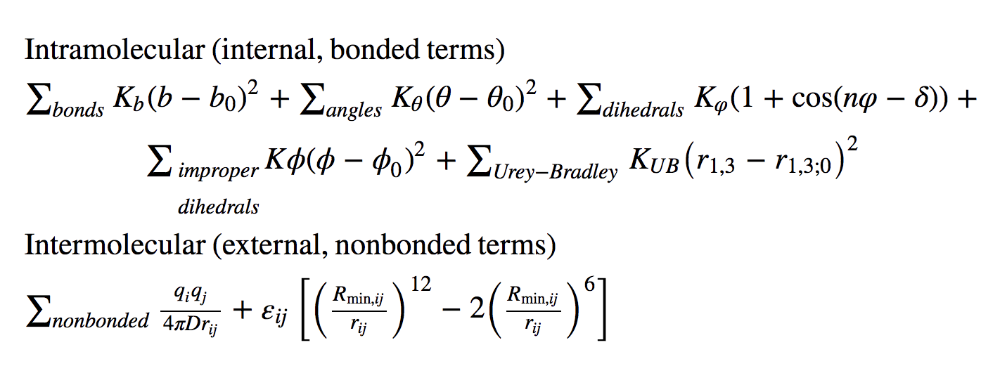
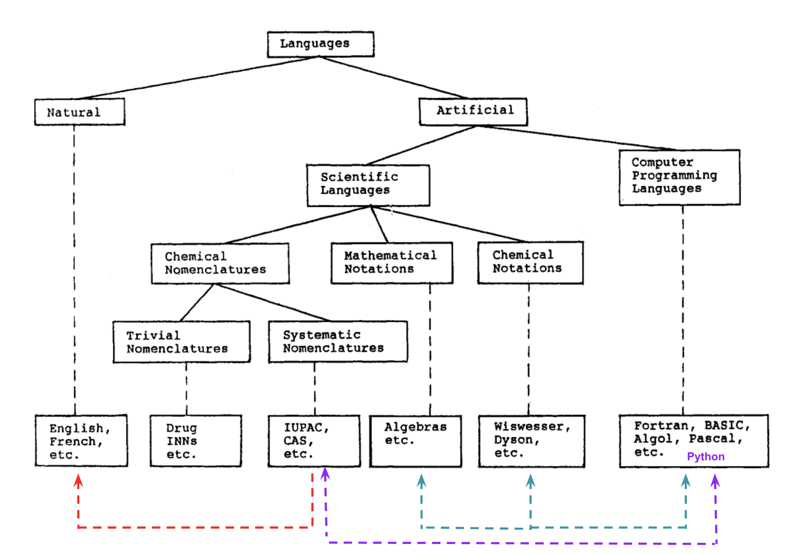
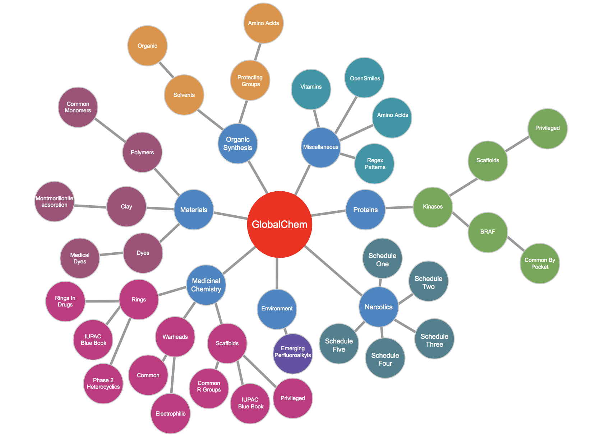
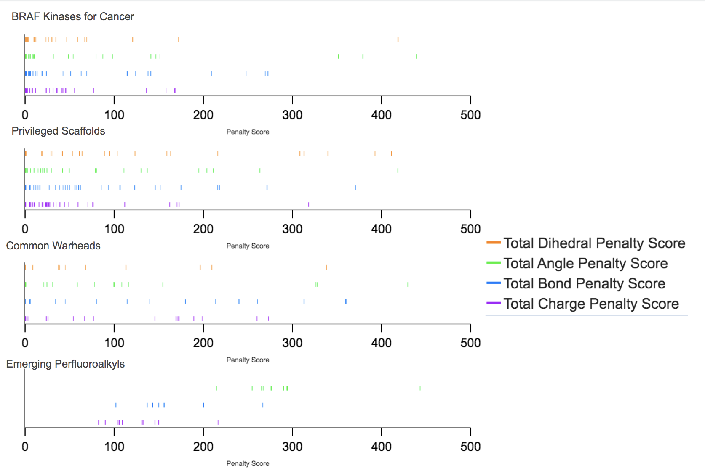
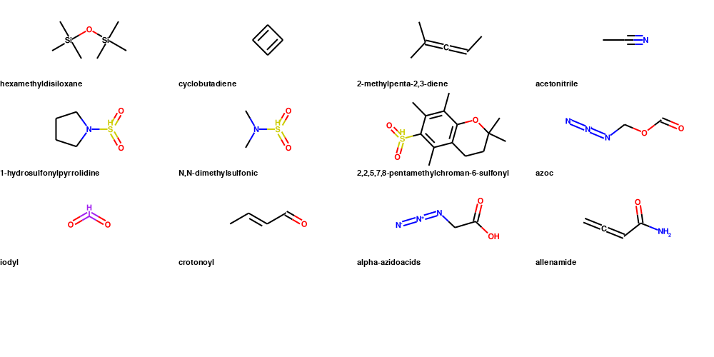

# Introduction

The in silico chemical universe is expanding rapidly as open access titan databases (Enamine Database (20 Billion) [@Gorgulla:2020-4],
Zinc Database (2 Billion) [Irwin:2020-12], PubMed Database (68 Million) [Roberts:2001-2]) and cheminformatic tools
to process, manipulate, and derive new compound structures are established. While this chemical data big bang has yielded useful ultra-large datasets they are based on ambiguous classification systems making it difficult to systematically organize them for specific uses.

  
   
  <i>Figure 1: Screenshot of the ZincDB request URLS</i>

For example, in `Figure 1`, the directory setup for downloading ZincDB molecules is shown. As is evident, the information content of the directory nomenclature does not contain information on the compounds they contain, making it nearly impossible to access specific molecules or classes molecules.  Towards overcoming this, partial organizational attempts were made in PubMed, filling chemical data linkages for computational toxicology called Actor for a specific
refactored and refined effort [Judson:2019-9]. In another example, for the EnamineDB a scaffold associated with biological activity was designed to target 
Toll-Like Receptors in an object-oriented fashion [Perez-Regidor:2016-9]. However, these organizational methods are difficult
to extend to other systems and can be difficult to implement given the large amount of data.
In addition, the information content of these papers is of limited utility to the common developer. 

To organize chemical compounds we apply the idea of communication. Humans use symbols and drawings to communicate, a set of symbols and the rules to combining them are called a language. Languages can be employed to carry relevant, distinct features and mean something to their respective community. diagrammatically shown in `Figure 2`. 
International Union of Pure and Applied Chemistry (IUPAC) was a coalition that formed in the 1800s and their method of communication was named after the organization, IUPAC. 
IUPAC is a written language that predates even drawing atoms as a method of communication between chemists [Cooke-Fox:1989-5]. 
Other chemical sub-communities adopted the IUPAC language and applied it to their fields that are comprised of different dialects i.e polymer chemistry, organo-metallic chemistry.
Due to it's "first to market" status, the scientific chemical language IUPAC is the legacy language that is the lexical key to unlocking information about a chemical pattern or group. 
But there are problems with the language due to it's length in describing bigger molecules. Simply, IUPAC names in organic chemisty papers are impractical, effecting extending the length of a manuscript,  while being of limited value given the challenge of interpreting such names.

To compact information, chemists presented drawings of chemical structures but information in such a format is hard to store precisely. Alternatively, SMILES [Weininger:1988-5] has become a popular 1-D language amongst cheminformaticians as a sufficient way to write and retain 2D chemical connectivity information with ease.  Algorithms
have been designed to abstract and interpolate skeletal patterns and languages from chemical drawings and convert them into SMILES for data processing and analysis. 
A number of these tools, which work to varying degrees of accuracy, have been well summarized by the Blue Obelisk Society Open Source Review [OBoyle:2016-9]. 
Efforts to improve these tools recently have included machine learning (ML) methods that essential "sit" on top of the underlying algoritm to fix any inaccuracies of the method. 
As an alternative we can take another direction, where data is selectively aggregated based on known classifications, popularity and utility, being organized to a degree of functionality that facilitates more widespread use. However, the criteria for such an aggregation of data is built upon human expertise, requiring input from a variety of people to attain the broadness and accessibility that would facilitate scientific discovery. In other words, in the context of a well-classified chemical database the major challenge is the enormity of the chemical universe, requring a range of chemical expertise to put togethe well-thought chemical lists of compounds relevant to their respective communities. Thus, it is necessary to create a tool to allow for a large number of participants to contribute in order for such a data compilation to grow. 
However, most software and especially old software can be difficult to install and handle on top of modern technology thus hindering participation. This situation drives the
need for a tool that is sustainable and readily accessible to potential participants, allowing the database to naturally grow.
This need motivated the development of the presented `Global-Chem` database tool.

To implement `Global-Chem` we selected a coding language that has the ability to write easy objects for particpants to understand; Python [10.5555/159351][Cooke:1989-5].

  
  <i>Figure 2: Language organized by category and functionality </i>

Python was also chosen because of it's distribution infrastructure that allows for easy installation of objects available on the cloud. This 
allows `Global-Chem` to function as a highly accessible tool that will allow users to readily access the chemical lists as well as to add content thereby continuosly expanding its utility. 

# Methodology and Implementation

## Chemical Set Selection & Object-Oriented Design Philosophy

Scientists, by nature of their work, are required to read extensively about 
selected scientific fields as well as access the associated data. This allows for scientists to develop expert knowledge in the fields and data they value most.
To take advantage of this knowledges requires a thin layer data organization that allows for the relevant information and data to be readily accessed.
To achieve this we begin by forming connections of the most relevant data according to chemicals sub-fields that have been authored
by experts in the different fields. `Figure 3` depicts the node Module layout of `Global-Chem`.  The layout shows an unweighted, 
arbitrary node hierarchy of the chemical sets included in `Global-Chem` as defined by the experts that introduce the data. Each blue circle represents a relevant field and their subsequent tree networks are highlighted by a contrasting colour.

  
  <i>Figure 3: Node Network of Global-Chem</i>

The tree network follows a simple object-oriented pythonic design in conjunction with literature where head nodes are the major corresponding scientific field (example: "Medicinal Chemistry") and their corresponding child nodes are the manuals, articles or books that are the references for the lists.
Each reference object has either the functional groups that correspond to that paper's overall functionality in IUPAC, Preferred Name, Acronyms, SMILES, or SMARTS
format. The motivation for this design was that as more users contribute they can expand into different directories, add their own directory, 
and provide their chemical list of interest. Each paper that is submitted is converted into a `namespace` module, an object
whose name is indicative of it's functionality. An example for the drug design community is the paper "Rings In Drugs" [Taylor:2014-6] whose
python object equivalent is now "RingsInDrugs" with two functional methods that retrieve the  IUPAC:SMILES/SMARTS dictionary that was embedded included in the master object `Global-Chem`. 
Users can choose to cross reference leaf nodes between each other and do comparative chemical list studies since the IUPAC name and SMILES name are consistent across lists.
Note that not all the SMILES being portrayed are canonical given that users can create their own SMILES, which are not unique. To account for this users can parse `Global-Chem` SMILES into the `RDKit` parser
for canonical SMILES conversion. 

## Data Collection

References and associatied compound lists are selected based on the interests of the scientific contributors.  This should include consideration of relevance to the scientific community. 
The SMILES strings may be abstracted in a variety of methods:

-  For simple molecules one representation of the SMILES can be directly translated using visual 
inspection. This is typically appropriate for compounds at the beginning of a reported list that contain the most common denominator rings. 

- For complex molecules the image can be redrawn in the free version of ChemDraw and then translated into SMILES. 

- For sources where the SMILES are written and the IUPAC is not known the SMILES are translated into ChemDraw and the name retrieved. 
Note that some of the names may be modified based on human inspection in favor of preferred names. 

- For polymer papers, the site points were omitted from the name and some of the nomenclature adjusted for preferred names
over traditional. For example: 'yl' to mark site points for polymer connections was removed in favor of reduced english complexity. 

- In the case of radicals, some SMILES were adjusted to remove the radical chemical feature as they serve as connection points. However in some cases the radical component was maintained, especially in the case of IUPAC blue book common substituents.

- SMARTS strings were adapted from the SMILES using RDKit [@Landrum:2019-5]

# Data

At the time of writing the list of objects include those shown in Table 1. The list range from well defined classes of chemicals, such as amino acids, to more diverse lists such as Rings in Drugs. In addition, the languages used for each list are given, along with the number entires in the list and the reference.  In addition, the number of times that compounds in each list fail in the CGenFF program, as discussed below, is given.

| Chemical List                       | Languages                    | # of Entries | References               |  CGenFF Errors            |
|-------------------------------------|------------------------------|--------------|--------------------------| --------------------------|
| Amino Acids                         | IUPAC/SMILES/SMARTS          | 20           | Common Knowledge         | 0                         |
| Essential Vitamins                  | Preferred Name/SMILES/SMARTS | 13           | Common Knowledge         | 0                         |
| Common Organic Solvents             | IUPAC/SMILES/SMARTS          | 42           | [Fulmer:2010-5]          | 3                         |
| Open Smiles                         | IUPAC/SMILES/SMARTS          | 94           | [OpenSmiles]             | 10                        |
| IUPAC Blue Book (CRC Handbook) 2003 | Preferred Name/SMILES/SMARTS | 333          | [CRC:2004]               | 1 (Excluding Radicals)    |
| Rings in Drugs                      | IUPAC/SMILES/SMARTS          | 92           | [Taylor:2014-6]          | 0                         |
| Phase 2 Hetereocyclic Rings         | IUPAC/SMILES/SMARTS          | 19           | [Broughton:2004-9]       | 0                         |
| Privileged Scaffolds                | IUPAC/SMILES/SMARTS          | 47           | [Welsch:2010-6]          | 0                         |
| Common Warheads Covalent Inhibitors | IUPAC/SMILES/SMARTS          | 29           | [Gehringer:2019-6]       | 4                         |
| Common Polymer Repeating Units      | IUPAC/SMILES/SMARTS          | 78           | [Hiorns:2019-6]          | 7                         |
| Common R Group Replacements         | IUPAC/SMILES/SMARTS          | 499          | [Takeuchi:2021-9]        | 15                        |
| Electrophillic Warheads for Kinases | Preferred Name/SMILES/SMARTS | 24           | [Petri:2020-12]          | 0                         |
| Privileged Scaffolds for Kinases    | IUPAC/SMILES/SMARTS          | 29           | [Hu:2021-3]              | 0                         |
| BRAF Inhibitors                     | IUPAC/SMILES/SMARTS          | 54           | [Agianian:2018-6]        | 5                         |
| Common Amino Acid Protecting Groups | IUPAC/ACRONYM/SMILES/SMARTS  | 346          | [Isidro-Llobet:2009-6]   | 41                        |
| Emerging Perfluoroalkyls            | IUPAC/SMILES/SMARTS          | 27           | [Pelch:2019-9]           | 1                         |
| Chemicals For Clay Adsorption       | IUPAC/SMILES/SMARTS          | 33           | [Orr:2019-9]             | 0                         |
| Schedule 1 United States Narcotics  | Preferred Name/SMILES/SMARTS | 240          | [21CFRPart1]             | 1                         |
| Schedule 2 United States Narcotics  | Preferred Name/SMILES/SMARTS | 60           | [21CFRPart1]             | 1                         |
| Schedule 3 United States Narcotics  | Preferred Name/SMILES/SMARTS | 22           | [21CFRPart1]             | 1                         |
| Schedule 4 United States Narcotics  | Preferred Name/SMILES/SMARTS | 77           | [21CFRPart1]             | 0                         |
| Schedule 5 United States Narcotics  | Preferred Name/SMILES/SMARTS | 8            | [21CFRPart1]             | 0                         |
| Common Regex Patterns               | Mol2                         | 1            |                          | N/A                       |

  <i>Table 1: GlobalChem Object List</i>

# Tests & Applications

A total collection of 2560 IUPAC/Preferred Name/Acronym to SMILES/SMARTS was collected (with redundacy) across 22 objects in
an organized fashion by subject. The code was refactored extensively to allow for ease of object addition according to subject and functionality.
`Common Regex Patterns` was omitted from the test because it's not a functional group but rather a substring pattern to extrapolate Tripos `mol2` file information. 

## Results 

To test the utility of these lists with other software tests were performed on three open source platforms to determine 
data interoperability. In addition, such tests can indicate cases in which some of the software implemented should be expanded to
include functional groups that could not be parsed. 

## Cheminformatics Test

Two open-source cheminformatic platforms are now widely considered as foundational tools: RDKit and Indigo. To test each SMILES string, each string gets
passed into a `Mol` RDKit object and `Indigo.loadMolecule()` object where any failures are recorded. 
Results on the number of failed compounds out of the 2560 compounds along with example of failed molecules is presented in Table 2.
Cheminformatic interoperability between different platforms promotes wider utilization. For example, OpenBabel is another
utility that may used as a tolerance checker.

| Software | Number of Failed Compounds | Example of Failed SMILES                                |
|----------|----------------------------|---------------------------------------------------------|
| RDKit    | 11                         | 'CSi(C(C)(C)C)C', 'C&1&1&1&1',                          |
| Indigo   | 8                          | 'C&1&1&1&1', 'CC(Si(C1=CC=CC=C1)C2=CC=CC=C2)(C)C'       |

  <i>Table 2: Compounds in Global-Chem that fail in RDKit or Indigo</i>

## Force Field Test

Access to broad collections of chemical groups will be of interest for development of force fields, also known as potential energy functions,[MacKerell:2004-10] for molecular modeling and molecular dynamic simulations, 
allowing for studies on a wider range of chemicals and biological systems. The ability of a force field to treat molecules in the database can also serve as dual interoperable test 
for SMILES strings. Popular force fields such as General Amber ForceField (GAFF) [Wang:2004-7], Optimized Potentials for Liquid Simulations (OPLS)
[Jorgensen:1988-7], and Charmm General Force Field (CGenFF) [Vanommeslaeghe:2010-3] are based on collections of chemicals that are representative of the particular region 
of chemical space that the force field was designed to cover. In practice, this involves the atom-typing engine of each force field being applied 
to each molecule followed by assignment of the appropriate parameters. This is to a large extent associated with the coverage of a force field.
Thus, the compound lists in Global-Chem can be used to identify specific regions of chemical space that have limited coverage and, therefore, 
represents future regions of chemical space for force field development. In the present study, we used CGenFF to check it's tolerance level for
the range of molecules currently in Global-Chem. To facilitate this an in-house extension of CGenFF was used that can assign atom types from `SDF` bond type column.
This enabled us to pass the SMILES strings through `RDKit` and transform `SDF` to a `CGenFF` stream output. The resulting failures are also presented in Table 1.
It should be noted by nature of the data processing workflow anything that fails in `RDKit` fails in `CGenFF`.

`CGenFF` was founded on small molecules representative of biological macromolecules and subsequently extended to drug-like molecules. 
The force field subsequently acted as the foundation for the development of the `CGenFF Program` [Vanommeslaeghe:2010-3] that inputs
molecules and outputs the topology information and parameters required to perform various types of molecular modeling and simulations
using programs such as CHARMM, NAMD, OpenMM and Gromacs [Jo:2008-06]. To test the ability of the CGenFF program to handle the chemical 
lists in Global-Chem each list was individually submitted to the program. As shown in Table 1, the range of failures varies widely.
The majority of lists associated with biological or drug-like molecules have zero failures. In contrast, lists such as Common R-group replacements 
or Protecting Groups show a number of failures. In addition, CGenFF does not cover radicals, which were excluded from the analysis. 
Thus, Global-Chem allows for areas of poor coverage of CGenFF to be identified, information that can be used to facilitate future force field development.

More granular information on the regions of chemical space that need additional development in CGenFF can be made based on the CGenFF penalty score distribution [Vanommeslaeghe:2012].
Penalty scores are attributed to molecules by the CGenFF program whose entire chemical connectivity is not present in CGenFF. When an arbitrary molecule is 
passed through the CGenFF program it navigates through a set of rules that represent a atom type similarity network tree.
Once atom types along with chemical connectivity are known, bonded parameters available in CGenFF are assigned to the molecule. 
If exact matches of the bonded parameters are not available, a second tree traversal browses for alternate parameter by using a second rules files that assigns penalties based on the analogy to known parameters. 
Once the lowest penalty score bonded parameter substitutions are determined, the `CGenFF Program` assigns those parameters along with the associated penalties.
In addition, the program identifies the original parameters that is also output into the stream file that is used in the 
various molecular modeling programs. Partial atomic charges and associated penalties are assigned through an extended bond-charge increment scheme where atom type along with chemical connectivity including  
bond, angle and dihedral are associated with charge increment values subtracted from the atoms formal charge. 
Thus, while the CGenFF program can successfully ingest a large number of molecules, the majority of those molecules are 
assigned penalties that indicate the level of analogy of the assigned bonded parameters and charges.
Larger penalities indicate a lower extent of analogy to known parameters, information that may be used to identify 
molecules for additional force field optimization.

Motivated by the availability of the CGenFF penalty scores we passed each object individually into the `CGenFF program` and recorded the results.
The penalty score distributions are shown in `Figure 6` in a rug fashion using Plotly [Plotly] to show the extent of `CGenFF` penalites
for the different chemical lists. As may be seen the extent of penalties differs significantly for the various lists. 
To understand the utility of this information we focus on five leaf nodes: Schedule One US Narcotics (240), BRAF Kinases Inhibitors for Cancer (54), Privileged Scaffolds (47), Common Warheads (29), [Gehringer:2019-6] and Emerging PerfluoroAlkyls (27). Schedule One are active drugs that are popular in the black market [21CFRPart1], kinase inhibitors should contain drug-like features, privileged scaffolds are selected compounds produced by nature, warheads are designed for covalent inhibition, and PerfluoroAlkyls include herbicides and other compounds that are toxic to humans. Based on the compounds used in the development of CGenFF,
we expected the penalties to be lower on drugs and drug-like species and higher for compounds from chemical manufacturing. 

  
  <i>Figure 4: Penalty Score Probability Distributions</i>

From `Figure 6`, if we use the charge penalty score as a metric for performance, it is evident that the `CGenFF program` 
assigns parameters with generally low penalty scores less than 200 for Schedule One and BRAF Kinase Inhibitors owed to its
initial training set of "drug-like" molecules. Privileged Scaffolds encompass a lot of natural products which 
have functional groups that fall into the definition of "drug-like" but not all as indicated by the purple lines  
between penalties 200 and 400 representing high charge penalties. A similar trend is seen with the Common Warheads, with most charge penalties being less than 200, but two prominent purple lines between 200 and 400 associated with high charge penalties, as these compounds contain drug-like features along with reactive functional groups that were not in the CGenFF training set. With both of these lists, it would be useful to identify specific molecules with high penalties and include them in the CGenFF training set. And lastly, Perfluoroalkyls are used in chemical manufacturing of everyday goods [Pelch:2019-9]. While the `CGenFF` training set did include halogens [Soteras:2016-10], motivated by their inclusion in many drugs, `CGenFF` was not extended to perfluoroalkyls.

Accordingly, for this list, there are no low penalty scores with the scores clustered in the intermediate range. This is consistent with halogens being inlcuded the training of CGenFF but the specific connectivity of perfluoroalkyls (long haloalkyl chains) not being included.
Accordingly, if even a few perfluoroalkyls are added to the `CGenFF` training set it will help reduce penalties and improve that treatment of this class of molecules making CGenFF of more utility to the chemical hazard community. 

In addition to the ability of CGenFF to treat the selected chemical lists discussed above other noteworthy failures are listed in `Figure 5`. 
For example, cyclobutadiene is a non-traditional ring system with a lot of ring strain although the carbon atom types are common.
`CGenFF` might determine that this particular ring system with it's existing atom type network is not allowed or detrimental to the network if added and needs to be handled with care. An interesting group that fails in CGenFF are allene-based compounds and perhaps warrants extension of the force.
Silicon has not been included in CGenFF leading to the failures of the silicon-based compounds. Similarly, the IUPAC blue book valuable list includes radicals, which are relevant for synthesis purposes. This is another class for `CGenFF`has not yet been parametrized.

  
   
  <i>Figure 5: Failed CGenFF Compounds</i>

Full logs of failed compounds are found in the `tests` directory in the github repository. 

### Discussion 

`Global-Chem` was developed to facilitate accessing lists of known chemical compounds as objects to allow them to be used in the context of python-based workflows.
However, it can also facilitate the evaluation of other tools to access chemical information in the form of SMILES. An interesting observation from the present data is the ability of tools to handle the ampersand `&` operator in SMILES for materials. 
For example, diamond is a common carbon substance whose SMILES strings is indicated in the OpenSMILES
documentation as a `C&1&1&1&1`. As shown in Table 2, this fails in both `RDKit` and `Indigo` indicating that improved handling of the `&` operator is required. 

Beyond accessing SMILES stings we've shown the utility of `Global-Chem` to interogate the coverage of the force field `CGenFF`. By partitioning chemical space into well-defined chemical lists, `Global-Chem` allows for regions of chemical space where the CGenFF programs fails or assigns parameters of low analogy to be readily identified. This information will allow for decisions to be made concerning the addition of molecules in the CGenFF training set thereby allowing for systematic improvements in the force field.

# Statement of Need

`Global-Chem` was developed to facilitate the ability of scientists in both academia and industry to make their compounds of interest readily available to the scientific community in the form of objects that may be directly accessed from python. 
Accordingly, `Global-Chem` has a number of potential purposes, including teaching and cheminformatics, but our main perogative is to create a free record collection.
As `Global-Chem` requires direct user input, if we plant the seed now then, hopefully, our tree will grow. 
The actual growth of the tree will be decided on by the common chemical community and experts in the field. Enjoy. 

# Acknowledgements

Thank you to Daniel Khavrutskii, Jacob Weiner, Tyree Wilson, and Paul Shapiro for their helpful discussions into the usability and functionality of Global-Chem.
Appreciation to past mentors James Ryan, Robert Zeigler, and Blake Printy for discussions on good manufacturing practices of python packaging and distribution.
Appreciation to the University of Maryland Baltimore, School of Pharmacy, Department of Pharmaceutical Chemistry for promoting a collaborative and useful space for 
academics. Financial support from the NIH (GM131710) is acknowledged.

# Conflict of Interets

ADM is cofounder and CSO and SJ is Commercial Development Director of SilcsBio LLC. Chris Burke is Senior DevOps Engineer at L7 Informatics. 