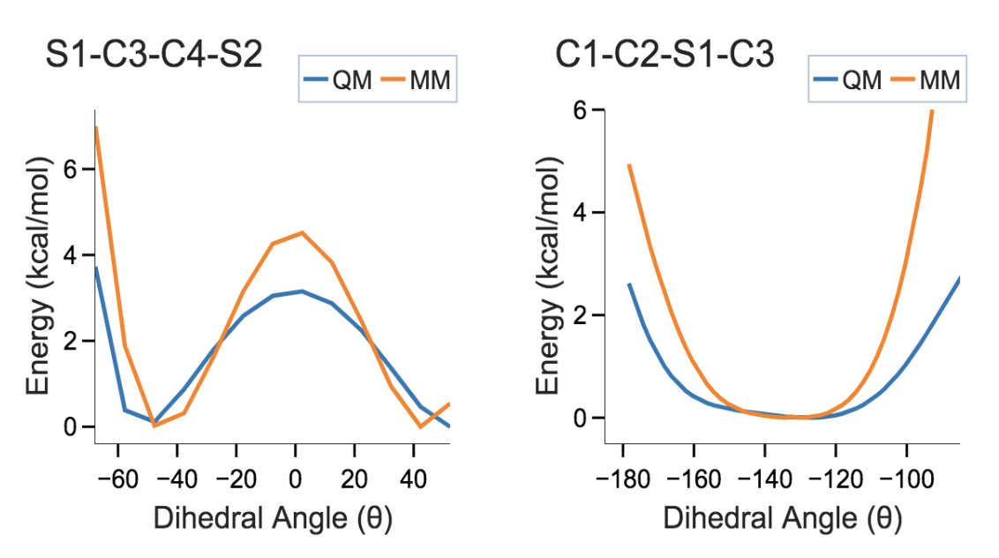

# Introduction

The *in silico* chemical universe is expanding rapidly as open access titan databases Enamine Database (20 Billion) (1),
Zinc Database (2 Billion) (2), PubMed Database (68 Million) (3) and cheminformatic tools
to process, manipulate, and derive new compound structures are established. While this chemical data big bang has yielded useful ultra-large datasets they are based on ambiguous classification systems making it difficult to systematically organize them and select molecules of interest based on the name. Previous organizational methods are hard to distribute to a mass audience and can be complicated to implement given the large amount of data. In addition, the information content is of limited utility because the software infrastructure it was designed on is hard to reproduce to the common developer. 

General Force Fields are designed to be "general purpose" force fields that capture chemical environments in the form of a dictionary of atom types and their physical properties in respect to themselves and each other. Major Force Fields such as General Amber Force Field (4), Optimized Potentials for Liquid Simulations (5), and CHARMM General Force Field (CGenFF, 6) were originally contrived from chemical lists that were "drug-like" since it was designed for the medicinal chemistry community. If we would like to expand CGenFF into moving beyond drugs we need to elect a variety of chemical space then molecules that serve as the best representation of their field. 

To select chemical compounds we apply the idea of communication. International Union of Pure and Applied Chemistry (IUPAC) is a written language that predates even drawing atoms as a method of communication between chemists (7). Over time, the IUPAC names naturally turned into a slang ("preferred") language due to humans wanting to speak it while communicating with each other. Effectively, the **natural** chemical language that is extant today is a blend of both a formal and informal nomenclature. To visualize chemical information, chemists presented drawings of chemical structures (skeletal diagrams) but information but, in recent modern times, drawings are not easy to query on a mass scale. Alternatively, a different way to encode compounds into the computer SMILES (8) designed for the organic chemist with a set of grammar rules became a popular 1-D language amongst cheminformaticians as a sufficient way to write and retain 2D chemical connectivity information. 

Penalty scores are attributed by the CGenFF program to molecules whose entire chemical connectivity is not present in CGenFF. When a molecule is passed to the CGenFF program it navigates through a set of rules that represent an atom type similarity network, a tree structure, similar to the Global-Chem file structure (9). Once its atom types along with chemical connectivity are known, bonded parameters available in CGenFF are assigned to the molecule. If exact matches of the bonded parameters are not available, a second tree traversal browses for alternate parameter by using a second-rules file that assigns penalties based on the analogy to known parameters. Once the bonded parameter substitutions with the lowest penalty score  are determined, the CGenFF Program assigns those parameters along with the associated penalties. In addition, the program identifies the original parameters that are also output into the stream file used in the various molecular modeling programs. Partial atomic charges and associated penalties are assigned through an extended bond-charge increment scheme. It consists in associating atom type along with chemical connectivity (including  bond, angle and dihedral) with charge increment values subtracted from the atoms formal charge. Thus, while the CGenFF program can successfully ingest a large number of molecules, the majority of those molecules are assigned penalties that indicate the level of analogy of the assigned bonded parameters and charges (10). 
 
To capture enough chemical lists we communicated, debated and elected resources of relevance and wrote a dictionary of IUPAC/Preferred to SMILES as it was stored, in its original nomenclature, **manually** to effectively learn the language, organize the chemicals appropiately by their purpose, and develop rules to ensure data integrity and consistency. We developed an in-house automated workflow to process IUPAC/Preferred to SMILES to CGenFF (11) to enable us to safely exchange chemical information between collaborators by something we can naturally speak to select the most relevant compounds using the penalty score as a feedback for us to determine where to look initially for force field paramitirization (12). 

     
    <i>Equation 1: Charmm Potential Energy Function with bonded terms (bonds, angles, dihedrals) including improper dihedrals (out of plane) and Urey-Bradley (1-3 interactions) and non-bonded interactions of the 6-12 Lennard-Jones (van der waals) and electrostatics (columbic)</i>

Selecting chemical compounds requires expertise. Expertise is gained by experience and studying a dedicated discipline. Dedicated displines most often have a set of common functional groups that are relevant to that community, this allows us to focus on compounds that are valuable. We do not need all the compounds, since a lot of them are not useful or not possible. In our paper, we describe how `Global-Chem`, an open source knowledge graph, was developed to facilitate the ability of scientists in both academia and industry to make their compounds of interest readily available to the scientific community in the form of objects that may be directly accessed from python. 

     
    <i>Figure 1: Open Source Knowledge Graph Layer 1 File Architecture of Global-Chem</i>

# Data & Features

At the time of writing the list of objects include those shown in Table 1. The list range from well defined natural classes of chemicals, such as amino acids, vitamins, salt, and to more diverse lists such as rings in drugs, emerging perfluoroalkyls etc. In addition, the languages used for each list are given, along with the number entires in the list and the reference. The number of times that compounds in each list fail in our automated SMILES to CGenFF workflow.

| Chemical List                        | Languages                    | # of Entries | References               |  CGenFF Errors            |
|--------------------------------------|------------------------------|--------------|--------------------------| --------------------------|
| Amino Acids                          | IUPAC/SMILES/SMARTS          | 20           | Common Knowledge         | 0                         |
| Essential Vitamins                   | Preferred Name/SMILES/SMARTS | 13           | Common Knowledge         | 0                         |
| Common Organic Solvents              | IUPAC/SMILES/SMARTS          | 42           | (13)                     | 3                         |
| Open Smiles                          | IUPAC/SMILES/SMARTS          | 94           | (14)                     | 10                        |
| IUPAC Blue Book (CRC Handbook) 2003  | Preferred Name/SMILES/SMARTS | 333          | (15)                     | 1 (Excluding Radicals)    |
| Rings in Drugs                       | IUPAC/SMILES/SMARTS          | 92           | (16)                     | 0                         |
| Phase 2 Hetereocyclic Rings          | IUPAC/SMILES/SMARTS          | 19           | (17)                     | 0                         |
| Privileged Scaffolds                 | IUPAC/SMILES/SMARTS          | 47           | (18)                     | 0                         |
| Common Warheads Covalent Inhibitors  | IUPAC/SMILES/SMARTS          | 29           | (19)                     | 4                         |
| Common Polymer Repeating Units       | IUPAC/SMILES/SMARTS          | 78           | (20)                     | 7                         |
| Common R Group Replacements          | IUPAC/SMILES/SMARTS          | 499          | (21)                     | 15                        |
| Electrophillic Warheads for Kinases  | Preferred Name/SMILES/SMARTS | 24           | (22)                     | 0                         |
| Privileged Scaffolds for Kinases     | IUPAC/SMILES/SMARTS          | 29           | (23)                     | 0                         |
| BRAF Inhibitors                      | IUPAC/SMILES/SMARTS          | 54           | (24)                     | 5                         |
| Common Amino Acid Protecting Groups  | IUPAC/ACRONYM/SMILES/SMARTS  | 346          | (25)                     | 41                        |
| Emerging Perfluoroalkyls             | IUPAC/SMILES/SMARTS          | 27           | (26)                     | 1                         |
| Chemicals For Clay Adsorption        | IUPAC/SMILES/SMARTS          | 33           | (27)                     | 0                         |
| Schedule 1 United States Narcotics   | Preferred Name/SMILES/SMARTS | 240          | (28)                     | 1                         |
| Schedule 2 United States Narcotics   | Preferred Name/SMILES/SMARTS | 60           | (28)                     | 1                         |
| Schedule 3 United States Narcotics   | Preferred Name/SMILES/SMARTS | 22           | (28)                     | 1                         |
| Schedule 4 United States Narcotics   | Preferred Name/SMILES/SMARTS | 77           | (28)                     | 0                         |
| Schedule 5 United States Narcotics   | Preferred Name/SMILES/SMARTS | 8            | (28)                     | 0                         |
| PihKal                               | Preferred Name/SMILES/SMARTS | 179          | (29)                     | 0                         |
| Excipients Cimetidine & Acyclovir    | Preferred Name/SMILES/SMARTS | 14           | (30)                     | N/A                       |
| HowToLiveLonger	                     | Preferred Name/SMILES/SMARTS | 4            | (31)                     | N/A                       |
| Monoclonal Antibodies                | Preferred Name/SMILES/SMARTS | 19           | (32)                     | N/A                       |
| Common Lubricants for Sex Wellness   | Preferred Name/SMILES/SMARTS | 38           | (33)                     | N/A                       |
| FDA Tainted Sexual Enhancements      | Preferred Name/SMILES/SMARTS | 4            | (34)                     | N/A                       |
| Common Food Salts                    | Preferred Name/SMILES/SMARTS | 14           | (35)                     | N/A                       |
| FDA Color Additive List 1            | FDA Name/SMILES/SMARTS       | 12           | (36)                     | N/A                       |
| FDA Color Additive List 2            | FDA Name/SMILES/SMARTS       | 15           | (36)                     | N/A                       |
| FDA Color Additive List 3            | FDA Name/SMILES/SMARTS       | 16           | (36)                     | N/A                       |
| FDA Color Additive List 4            | FDA Name/SMILES/SMARTS       | 39           | (36)                     | N/A                       |
| FDA Color Additive List 5            | FDA Name/SMILES/SMARTS       | 27           | (36)                     | N/A                       |
| FDA Color Additive List 6            | FDA Name/SMILES/SMARTS       | 29           | (36)                     | N/A                       |
| FDA Color Additive List 7            | FDA Name/SMILES/SMARTS       | 37           | (36)                     | N/A                       |
| Constituents of Cannabis Sativa      | Name/SMILES/SMARTS           | 394          | (37)                     | N/A                       |
| Phytocanniboids                      | Name/SMILES/SMARTS           | 111          | (38)                     | N/A                       |
| Organophosphorous Nerve Toxic Agents | Name/SMILES/SMARTS           | 14           | (39)                     | N/A                       |
| Cengage Bronsted Acids               | Name/SMILES/SMARTS           | 42           | (40)                     | N/A                       |
| Common Regex Patterns                | Mol2                         | 1            |                          | N/A                       |

  <i>Table 1: GlobalChem Object List Columns: "Chemical List" is the name of the node that contains the chemical list, "Languages" specifies the name and their respective translations, "Number of Entries" is how many molcules exist within one node, "References" are the what resource the molecules were recorded from, and the last column "CGenFF Errors" is the many times CGenFF skipped a molecule. If the value is "N/A" it means it was a node added after testing and allows room for additional chemical space exploraton.</i>

At the time of writing the list of features include those shown in Table 2. The list range from well defined algorithms implemented into Global-Chem and their respective description and discipline.

| Software Feature              | Description                                                                    |  Code Length | Discipline | Reference |
|-------------------------------|----------------------------------------------------------------------------------------------------------------------------------------------------|---------- |-----------|--------------|
| Validating SMILES             | An adapter to other SMILES platforms (RDKit, PySMILES, SELFIES, PartialSMILES, DeepSMILES, MolVS) to validate by interoperability           | 107        | Cheminformatics          |  (41, (42), (43), (44), (45), (46) | 
| Decoding Fingerprints and Classifying SMILES            | Decoding your fingerprints to your complex SMILES and to an IUPAC using a annotated dictionary of bit vectors | 129        | Cheminformatics          | (47) |
| SMILES Bidirectional PDF Parsing      | Converting lists of SMILES to 2D drawings in PDF parsing and parsing PDF back to SMILES | 685        | Cheminformatics          | (48) |
| Drug Design Filtering      | Filtering lists of SMILES by a variety of common drug filters (Lipinski Rule of 5, Ghose, Veber, Rule of 3, REOS, Drug-Like, Filters | 137        | Cheminformatics           | (49), (50), (51), (52), (53), (54) |
| Deep Layer Scattering     | Scattering Nodes of Collective SMILES and their relations to each other in Parallel Coordinate Diagram implemented in Plotly | 184        | Cheminformatics          | (55) |
| SMARTS Identifier     | A web application implemented in Flask to test the validation of SMARTS submatching of strings against the MiniFrag Database | 307        | Cheminformatics          |  (56) |
| Protonating SMILES    | A distributable version of the Dimorphite-DL package to protonate SMILES over a range of pH with a control over variant production | 56        | Cheminformatics          | (57) |
| Sunbursting SMILES    | Applying a sunburst plot to large collection of SMILES to identify functional groups and pairs of functional groups within the set | 253        | Cheminformatics          | (58), (59) |
| Peptide Sequence to SMILES    | An evolution of Cocktail-Shaker to include Lanthipeptides and covalent sulphur linkages in SMILES strings | 147        | Cheminformatics     | (60) |
| Visualization SMARTS    | A python application programming interface to port the SMARTS.plus visualizer for SMARTS strings into a jupyter notebook | 47        | Cheminformatics          | (61) |
| One-Hot Encoding SMILES    | A GlobalChem encoder that encodes SMILES for Machine Learning including the '&' denoted as a polymer ex. Diamond | 112        | Cheminformatics          | (62) | 
| Principal Component Analysis on SMILES    | A principal component analysis on a list of SMILES with hyperparamter tuning for morgan fingerprinting provided and visualization with Bokeh | 154        | Cheminformatics          | (63), (64) |
| Networkx Adapter    | A graph to graph network adapter between GlobalChem and NetworkX for ease of interoperability for data engineering | 65        | Cheminformatics          | (65) |
| Scaffold Graph Adapter   | An adapter to take a large collection of GlobalChem Nodes and analyze their Structure Hierachy with Scaffold Graphs | 97        | Cheminformatics          | (66) |
| GlobalChem Protein  | An adapter to biopandas to process pdb protein files as well as an implementation of the Bostrom Algorithm to Structurally Filter SMILES | 467        | Bioinformatics          | (67), (68) |
| GlobalChem RNA  | Conversion of RNA Sequence to SMILES and a visualizer for RNA sequences for Python Jupyter Notebooks | 181        | Bioinformatics          | (69) |
| GlobalChem DNA  | Conversion of DNA Sequence to SMILES and a visualizer for DNA sequences for Python Jupyter Notebooks | 181        | Bioinformatics          | (69) | 
| GlobalChem Bacteria  | A python model with attributes for general bacteria classifications as well as a common list | 214        | Bioinformatics          | (70) |
| GlobalChem Monoclonal Antibodies  | A python model with attributes for general monoclonoal antibodies classifications as well as a common list | 20        | Bioinformatics          | (71) | 
| Z-Matrix Store  | A python model store where users can pull standard z-matrices for molecules queried by their IUPAC | 159        | Quantum Chemistry          | (72) |
| Psi4 Parser  | A python model for analyzing psi4 output files and plotting interaction energy data automatically through Plotly | 193        | Quantum Chemistry          | (72) |
| Moly Adapter  | A software adapter and enhanced functionality for Moly and visualizing HOMO/LUMO orbitals of molecules | 87        | Quantum Chemistry          | (73) |
| GlobalChem Molecule  | A Global Molecule that can parse SMILES, GAFF, CGenFF Stream files into Pandas dataframes, a visualizer with Atom Types and SMILES in RDKit, new mix of cross-discipling languages (SMILES and CGenFF Atom Types) using CXSMILES, CXSMARTS, and CurlySMILES | 386        | Force Fields         | (74), (75), (76) | 
| CGenFF Molecule  | A CGenFF Parser that can parse, write edit, and update stream files with Pandas DataFrames | 532        | Force Fields         | (77) |
| GAFF2 Molecule   | A GAFF2 Parser that can parse, write edit, and update stream files with Pandas DataFrames  | 454        | Force Fields         | (77) |
| CGenFF Disimiliarity Score   | A CGenFF dissimilarity algorithm based on the atom types and their tuples of bonded parameters (bonds, angles, dihedrals, impropers) to determine a dissimilarity score | 191        | Force Fields         | (78) |
| Open Source Database Monitor   | An open source database monitor that performs heartbeat checks on common chemical lists running on cloud web servers | 95        | Development Operations         | (79) |
| Plotly Templates   | A Graphing template to use for Ploty to make your data look "pretty" | 80        | Graphing         |

  <i>Table 2: Global-Chem-Extensions Feature List Columns: "Feature" name of the feature model, "Description" a summarized account of what the feature does, "Feature Code Length" is how many lines does the actual feature occupy not including infrastructure, "Discipline" is what scientific discipline and distribution pathway does the feature exist, and the last column "References" is what scientific resource, if any, does the feature stem from.</i>

# Chemical List Selection & Force Field Paramitirization

Compound lists in Global-Chem can be used to identify specific regions of chemical space that have limited coverage. Therefore, the compound lists in Global-Chem represent future regions of chemical space for force field development. In the CGenFF program we can use larger penalities to indicate a lower extent of analogy to known parameters, information that may be used to identify molecules for additional force field optimization. We passed a variety of Global-Chem objects individually into the software and plotted penalty score distributions of their bonded and non-bonded parameters shown in `Figure 2`. As may be seen the extent of penalties differs significantly for the various lists. Based on the compounds used in the development of CGenFF, we expected the penalties to be lower on molecules that are declared as drugs (Schedule One US Narcotics) and drug-like species (BRAF Kinases Inhibitors for Cancer,  Privileged Scaffolds) whereas we expect the penalty score will be higher for compounds for things that are were not it's original intention ( Emerging PerfluoroAlkyls for Environmental Hazards). 

  
  <i>Figure 2: Penalty Scores Probability Distributions of the Bond, Angle, Dihedral, and Charge in a rug fashion</i>

For force field paramitirization, we want to focus on the most interesting compounds based on human expertise and on the charge
penalty score as an indicator to a new chemical environment that was left unaccounted for in `CGenFF`. This avoids brute force paramitirization 
on mass molecular datasets with no clear intention and allows our force field to remain the best chemical space representation of the community
with human guided direction. To demonstrate our versatility, we use our own tools to explore both avenues of explored and unexplored chemical space.
In Figure 2, when evaluating the distributions of the penalty scores and the nodes that accommodate it, we can begin to evaluate trends to provide
an initial guess of where to look for most likely a compound that wasn't accounted for rapidly. We recorded partial G, V, and A-series toxic agents according 
to Dr. Mirzayanov's account of the Novichok Program (80). Novichok-5 and Sarin contained fluorophosphane bonds that CGenFF has not seen before evident by the partial charge of the phosphorous with penalties upwards of 200. 
We can attribute these high scores to its unique chemical environment specifically designed for warfare which qualifies them as relevant candidates given their history.
If we investigate the covalent warhead inhibitors with a distribution of charge penalty scores ranging from 0 to 300 in Figure 2.
The range indicates that we have accounted for some warheads but in the most recent years they have gained popularity and are being employed elsewhere especially synthesis. Aziridine, in Figure 3, was chosen because it's similar to an epoxide, acting as a good electrophilic drug fragment to extend a molecule by 2 carbons and provide a terminal reactive amine functional group for further extension.
The difference in the CGenFF atom type assignment of the Aziridine is the categorical layer where the oxygen in a 3-ring membered ring system have their own specific sub category and 3-membered ring nitrogen do not. This suggests
the developers of the CGenFF should consider adding a new atom type for this compound. Perfluorobutanoic acid, in Figure 3, is a common herbicide that is popular for the environmental protection agency with a unique chemical pattern where fluorine takes the place of each hydrogen along the alkyl chain, and with, typically, a tail carboxylic acid. This is not typical feature of drug-like molecules and is shown with majority of the charge penalty scores being higher on average on the charge penalty score distribution in Figure 2. This makes them a prime candidate for force field paramitirization. 
Look at the common vitamin list in Figure 2 we found Vitamin C to have a high dihedral penalty scores which was unexpected initially due to it's legacy as an important ubiquitous compound but deeper look into the parameters suggest that the chemical environment,the sp2 carbon in the furanone with surrounding hydroxyls as seen in Figure 3, suggest that this would be tough to navigate through paramitirization. Finally, a dithiolane fragment was discovered using the sunbursting, principal component analysis, and pdf parsing features provided in Global-Chem, when analyzing partial of the Enamine Database, and using Global-Chem's RingsInDrugs as a reference for filtering common ring systems to display emerging ring systems of interest to find **rare** viable ring systems. The 1,3-dithiolane was selected because of its simple cyclopentyl architecture but two sulphurs separated by 1 carbon makes a great potential drug fragment anchor to enhance binding affinity due to the nucleophicility of the sulphurs and their respective geometry. `CGenFF` did not recognize this structure and was ultimately selected as the first compound for force field paramirization with the full account provided in the Supporting Information. 

   
  <i>Figure 3: MolCloud of Chemical Selection</i>

### 1,3-Dithiolane

We truncated dithiolane from the amide and passed through CGenFF (Full data available in the Supporting Information) which indicated that the dilemma was in part due to the extent of puckering caused by the 2 Sulphur atoms within the constrained cyclopentane ring system.
To begin our paramitirization process we chose to focus on `S1-C3-C4-S2`, backbone to the cyclopentane ring and the dihedral from the methyl to one carbon on the backbone `C1-C2-S1-C3`. Since the molecule is symmetric, it makes the complexity of the molecule decrease twofold. 
The parametirization of 1,2-dithiolane was performed using FFParam (81) following the FFParam Workflow (82). To begin our process, we first subject the compound to quantum mechanics (QM) geometry optimization, with Gaussian (83), using mp2 theory to treat electron correlation (84) and basis set of “6-31/+G*” to handle the orbital polarizability of the sulphur atom (85). 
Our intended goal is to use the QM as a reference target data that the molecular mechanics (MM), CHARMM (86), should approximately match. We perform potential energy surface (PES) scans around our selected dihedrals and compare the surface of the QM vs the MM. 

To match the PES scan for the MM to the QM we have to tweak “tunable” parameters as defined in charmm potential energy function (i.e force constants, multiplicity) (87) until we reach a reasonable surface scan and numbers that make common sense. To determine the partial charges, we observe 
the dipole moment induced by the interaction between the atom of interest and water. When the dipole moment of the QM and MM reach within a range 
(< 0.5kcal/mol) we consider that reasonable. 

To accomplish our parametirization we applied the following: for `S1-C3-C4-S2`, if we break the connection ring component 
around the C3-C4 single bond in the  atom ring we obtain a natural rotation of a thiomethyl group. Additional multiplicities of 1 and 2 of varying force constants
seemed to have a negative effect. We added a relatively high force constant of a value of 2.3800 to because this particular 
dihedral is part of a ring where there is a significant energy barrier of rotation due to constraint of the cyclopentane backbone. 

For C1-C2-S1-C3, still maintained the multiplicity of 3 but with a far less reduced force constant of 1.1000. 
This was due to the methyl that replaced the amide allowing some degrees of rotation but the S1 is still constrained within the ring system. 
Final PES scans are displayed in Figure 4. 

  
   
  <i>Figure 4: Final Potential Energy Scans of dihedrals S1-C3-C4-S2 and C1-C2-S1-C3</i>

Lastly, the S1-S2 charges needed adjustment. We used Monte Carlo Simulated Annealing (MCSA) method (88) utilized in
FFparam to predict the approximate partial charges. The sulphur atoms were adjusted to have a partial negative charge of -0.208.

# Chemical Graph Theory 

Global-Chem comes with a variety of applications and with accessible data comes new avenues of research, here we present our gallery of a highlight features that we find the most interesting to us, the authors. 

### Knowledge Graph Application Programming Interface

Global-Chem uses a directory and sub-directory system to organize files as we, the community, see best. If you, the users, would like to build your own graph networks we would like to have that ability as well. Global-Chem classifies each file or directory as a Node, using a Dummy Node named "Global-Chem" as a root. For example, in Figure 5, section A is a Global-Chem node, "parent", with 6 nodes, "childern" connected on some arbitrary line. Each node is self-aware of only it's parents and children which allows for a user to determine their own navigate into the graph network. This was designed in a way to allow flexibility for variable change, a look into adding a node object algorithm is shown in section B in Figure 5. A prototype feature would be too add nodes in a series of layers and have all parents connect to all children in a sequential fashion which allows for a node architecture similar to deep learning represented in section C Figure 5. 

   
  <i>Figure 5: "Section A" Example of Global-Chem root node with 6 child nodes, "Section B" is a screenshot of the technical documentation of the algorithm into adding a node into the network, "Section C" is the representation of a deep layer network of the graph nodes with a similar adding mechnamism as Section B. </i>

With readily availablitily of the data and allowing users to own graph model or build their own allows for possibility a more robust artifical intelligence for organic chemistry.    

### General Molecular Language 

CGenFF and SMILES are built on the same language philosophy yet are independent of each other. Global-Chem serves as a basis generator in combining the languages into something is intuitive to read. CurlySMILES is a subset language of SMILES used to embed a meta data next to a alpha element character for example "C" which means carbon can be read as "C{CG2R61}" a aromatic benzene sp2 carbon. When applying this feature to a more complex molecule we can see how the new bridged language unfolds. We suggest a new language based that contains both CGenFF Atom-Types and SMILES based on scientific inclusion not exclusion (92):

| Name                         | Weininger SMILES Language | New Language Suggested                                                                          | 
|------------------------------|---------------------------|-------------------------------------------------------------------------------------------------|
| Perfluorobutanoic acid       | FC(F)(C(F)(C(O)=O)F)C(F)(F)F	  | F{FGA2}C{CG312}(F{FGA2})(C{CG312}(F{FGA2})(C{CG2O2}(O{OG311})=O{OG2D1})F{FGA2})C{CG302}(F{FGA3})(F{FGA3})F{FGA3}     |
| Vitamin C                    | C(C(C1C(=C(C(=O)O1)O)O)O)O	    | C{CG321}(C{CG311}(C{CG3C51}1C{CG2R51}(=C{CG2R51}(C{CG2R53}(=O{OG2D1})O{OG3C51}1)O{OG311})O{OG311})O{OG311})O{OG311}  |
| Aziridine                    | N1CC1                          | N{NG311}1C{CG3C31}C{CG3C31}1                                                                                         |
| 1,3-Dithiolane               | CC2SCCS2                       | C{CG331}C{CG3C51}2S{SG311}C{CG3C52}C{CG3C52}S{SG311}2                                                                |

  <i>Table 3: Global-Chem Molecular Columns: "Name" name of the molecule, "Weininger Notation" is the original SMILES notation,  "Proposed New Notation" is the SMILES and CGenFF Atom Types language representation in CurlySMILES </i>

Using this new notation, we can infer  easily from which atom type could be incorrectly misassigned without looking at the partial charges in conjunction with the SMILES allowing intuition to supersede the penalty score and using it as an ultimate feedback loop for validation. For example, a N1 in a 3 membered ring, for Aziridine, is mostly likely not going to be NG311 but probably a new atom type because it is too general of an atom type, using the CGenFF nomenclature we can safely make assumptions of what it can be, perhaps NG3C31, which allows us to expand rapidly in predicting new chemical space and allowing a queryable language to bridge atom types to ultimately bridge to the Name using Global-Chem.

# Applications 

### Cheminformatic Intereoperability

Global-Chem parsed through seven different tools with majority being successful minus diamond represented with an 'C&1' (14) and fails with all software including RDKit indicating a possible new addition to the grammar that has been left unaccounted for. The percentage of passing is as follows: RDKit 100% (41), DeepSMILES 99.25% (45), PartialSMILES 85.7% (44) , SELFIES 100% (43), MolVS 98.5% (46), PySMILES 99.8% (42) presented in Table 4. PartialSMILES proved to be the most robust acceptance/rejection tool in identifying incomplete SMILES and highlighting errors within Global-Chem. 

| Software        | Failed Compounds | Example of Failed SMILES                                   |
|-----------------|------------------|------------------------------------------------------------|
| RDKit           | 0                |                                                            |
| SELFIES         | 0                |                                                            |
| Indigo          | 8                | 'CC([Si](C1=CC=CC=C1)C2=CC=CC=C2)(C)C'                     |
| PySMILES        | 5                | '[a].[Na+].[K+].[Mg+2].[Ca+2].[Cl-]'                       |
| DeepSMILES      | 8                | 'OC(C1=CC=CC=C1N2)C2=O', 'C1(N2C(CN=C3)=NN=C2)=C3C=CC=C1'  |    
| MolVS           | 24               | 'n1ccnc1', 'HF', 'O=N1CCCCC1'                              |
| PartialSMILES   | 337              | '[CH]C', '[N]=[N+]=[N-]'                                   |

  <i>Table 4: "Software" Cheminformatic Software with their respective subset of SMILES interpreters, "Failed Compounds" are the number of failed common compounds in Global-Chem, "Example of Failed SMILES" is some examples of the failed SMILES that highlight the performance of each software on different sets of SMILES strings and what type of molecules they can process.</i>

Indigo's encoder was pretty robust and their software allows for a lot of inteoperabiltiy with different software tools (i.e pdf data parsing of SMILES), when faced with the tert-butyldiphenylsilyl protecting group and the SMILES string with the `Si` is not wrapped in a square brackets that specify an element that doesn't have a complete valence shell. For PySMILES, the inclusion of the '[a]' denoting aromaticity for an "aromatic salt" in the database couldn't be processed. Some other encoders have encoded for an aromaticity keyword as specified in the Daylight Technical Documentation (14).  DeepSMILES was interesting because it failed on specific functional groups as shown in the example with an oxindole and triazolodiazepines that had complex small branch complexities and moetieies that it didn't foresee existing. MolVS had some interesting results where imidazole (and derivatives) failed probably because it expected for a hydrogen perhaps to be explicity stated due to it's varying protonation states. Hydrofluoric acid was something I was expecting but again the hydrogen actually needed to be enforced with a [H] which is not as intuitive. PartialSMILES proved to be the most robust eluding to SMILES that were partially complete and rejected by their criteria. Failures included a ethyl radical and a azido complex stemming from the interstellarspace molecules. 

### Chemical Education 

Chemical Education is important for future generations and especially organic chemists in learning the modern nomenclature of the disicipline. Flash cards are the most common way for students to learn organic chemistry functional groups (89). Global-Chem uses this mechanism to created a Global flashcard list of all functional groups relevant to different communities so students can learn chemical structures, their names, and the SMILES that are relevant to their respective field as they learn. This installs foundational knowledge of chemical language which will be useful in their respective careers, shown in Figure 6 and available at www.chemicalgraphtheory.com. 

  
   
  <i>Figure 6: Global-Chem Flash Card Application</i>

### Machine Learning

Morgan Fingerprints (90) are one of the most common fingerprint mechanism used to day to capture a local chemical environment. The radius of a local environment is captured through integers denoting how many times to iterate from one connection point to another. By iterating through each atom in a molecule and capturing it's local environment we can capture fragments of molecules and piece them back to together to represent the molecule as a whole. This is done in the form of binary strings implemented in RDKit.

| Name          | Binary String                                                                                                        | 
|---------------|----------------------------------------------------------------------------------------------------------------------|
| Benzene       | 00000000000000000000000000000000000000000000000000000000000000001000000000000000000000000000000000000000000000000000000000000000000000000000000000000000000000000000000000000000000000000000000000000000000000000000000000000000000000000000000000000000000000000000000000000000000000000000000000000000000000000000000000000000000000000000000001000000000000000000000000000000000000000000000000000100000000000000000000000000000000000000000000000000000000000000000000000000000000000000000000000000000000000000000000000000     |
| Toluene       | 00000000000000000000000000000001010000000000000000000000000000001000000000000000000000000000000000000000000000000000000000000000000000000000000000000000000000000000000000000001000000000010000000000000000000000000001000000000000000000000000000000000000000000000000000000000000000000000000100000000000000000000000000000000000000000000000001000000000000000000100000000000000000000000000010000100000000000000000000000000000000000000000000000000000000000000000000000000000000000000000000000000000000000000000000000000  |
| Phenol        | 00000000000000000000000000000000000000000000000000000000000000001110000000000000000000000000000000000000000000000000000000000000000000000000000000000000000000000000000000000001000000000000000000000000000000000000001000000000000000000100000000100000000000000000000000000000000000000000000000000001000000000000000000000000000000000000000001000000000000000000100000000000000000000000000000000100000000000000000000000000000000000000000000000000000000000000000000000000000000000000000000000000000000000000000000000000                                                                                        |
| Aniline       | 00000000000000000000000000000000000000000000000000000000000000001000000000000000000000000000000000000000000000000000000000000000000000000000000000010000000000000000000000000001000000000000000000000000000000000000001000000000000000000000000000000000000000000000000000001000000000000000000000000000000000000000000000000000000000000000000001000000000000000000100000000000000000001000000000000100000000000000000000000000000000000000000001000000000000000000000000000000000000000000000000000000000000001000000000000000                                                                             |

  <i>Table 5: Global-Chem Annotated Bit Reference Index: "Name" name of the molecule, "Binary String" is the bit representation of the molecule with 512 bit length and a morgan radius of 2. </i>

When evaluating binary we can observe patterns for how a molecule is fragmented. In Table 5, Benzene can serve as a marker for any six-membered aromatic compound as a reference. When we expand into the second row looking at toluene we can begin to identify which numbers correlate to benzene and which relate to the methyl group and the respective bit topology. Comparing toluene to benzene at positions 32, 33, 34 with "101" we can start to infer this means a possible bond type from the sp2 carbon to sp3 for the methyl or another connection point. If we exchange the methyl for a hydroxyl we can observe the following bit representation where the positions from 32, 33, 34 of the toluene are reduced back to 0s yet expansion of the binary string at position 64, 65, 66 with a sequential "111" which might suggest the sp2 carbon with oxygen bond which is completely reduced to 0s in aniline. By having a reference annotated index we can read binary strings directly and decode the string which served as a motivation for the development of the decoder engine. Machine Learning often requires converting the SMILES to a encoder with some hyper parameters that account for how the the bit representation of the molecule is encoded because machines learn on numeric characters not alpha. Decoding fingerprints is handled through visualization which disallows safe passage of chemical communication because it isn't recorded effecively. To solve the problem, Global-Chem is a list of common small molecules which can be extended to a reference index of common fingerprints which allows for drawings of bit representations to have an associated name, the decoder engine schematic can be found in Figure 7.

   
  <i>Figure 7: Decoder Engine's placement into the Machine Learning Workflow</i>

### Levenshtein Distance IUPAC/Preferred Names

IUPAC and Natural name submatching would be of best interest in determining functional group similaritiy between two different names of compounds of unequal length. Global-Chem implements the Levenshtein Distance (91) without grammar modifications to generate the best naming fit as possible if an exact definition is not known. With the inclusion of grammar, molecular similarity on IUPACs with long names (large molecules) might be possible to deduce common functionality and connection points and a new avenue area for chemical linguistic research.  

# Open Source

### Legal

Legal research was performed in the implementation of Global-Chem and serve as precedence for future packages to follow the same legal infrastructure. Global-Chem was filed under the "Mozilla Public License 2.0" namely for the purpose that if a company uses the Global-Chem in any commercial software must defend the code contributors should any lawsuits or damages arise regarding that software. This helps validate and form a legal bridge between academia and industry. Global-Chem does not grant trademark or copyright rights, and was filed with the U.S Copyright and U.S Patent and Trademark Office. Global-Chem, the graph network, has no other dependencies and is a self-contained code. However, the extensions for functionality do have dependencies of roughly 
106 open source licenses and 1106 dependecies of a depth of to 5. To manage legal at scale we used free open source software academia, FOSSA, to perform dependency search. 

### Compliance

Global-Chem follows the same principles outlined in part 11 of Title 21 of the Code of Federal Regulations; Electronic Records, Electronic Signatures (21 CFR Part 11) guidance documentation. Since there are no formal guidelines for how open source software should be handled, we attempt at completing requirements. The Federal Drug and Administration (FDA) considers part 11 to be applicable to the following criteria of electronic records and, using our software architecture, we show how Global-Chem accomplishes each component:

Plausabilitiy: Global-Chem was built on data that was abstracted from books and papers using reading and redrawing. It adds a component of IUPAC/SMILES/SMARTS strings to store it electronically which give it's data it's unique component. The records are open sourced and appropiately version controlled by maintainers of the repository and open source community feedback. Global-Chem's purposes are still unknown as it enters open source deployment. We have built extended functions that live in a seperate package Global-Chem-Extensions that do depend on Global-Chem. Since each version is packaged appropiately, if reliance on a version is a need then it's software is available on Github and PyPi. A Standard Operating Procedure (SOP) can be filed submitted from the extensions utility documentation maintained on Gitbook.

Validation: Global-Chem follows Good Automated Manufacturing Practice (GAMP) Category 3 which is "software that is used as installed" and potentially "configurable". Global-Chem testing comes from within, the documentation serves as the ultimate test for functionality because that is what the users will test the most since we rely on open source. A continous integration (CI) system is also built concomitantly to serve as basic functionality testing of the Global-Chem knowledge graph. The Data stored is maintained by experts in the field but subject to change based on community feedback if an error is found.

Audit Trail: Global-Chem is version controlled with Git and hosted on Microsoft's platform Github. Global-Chem follows a semantic versioning control of the schema X1.X2.X3: X1 marks formal stable releases with tests and docuementation and mean big refactoring to the software or in functionality, X2 means a new feature is added with or without tests and documentation but iterates as so. X3 means a "hot" fix (something that is a an easy bug), small feature or additional parameter to add to a function , or iteration to the data.

Legacy Systems: Global-Chem has been operational for nearly three years since it's first release with version 0.3.0 in May 2020. Global-Chem was built with a full trail in the open source community with each version catalogued and visibility to all. This satisfies the rules outlines for determining a legacy system. We use community feedback provided from social media platforms (Twitter, Github, LinkedIn) as documented evidence and justification that GlobalChem is fit for it's intended use of cheminformatics.

Copies of Records: Global-Chem has records stored on Github for the software that can be exported to a variety of formats as provided by Microsoft. For documentation, it is hosted on Gitbook and versioning controlled in accordance to the software. Each "book" can be exported into Portable Data Format (PDF) appropiate for FDA submission.

Record Retention: Global-Chem has a record of the documentation versioned controlled to a unique id (UUID) that serves as it's identifier for each iteration stored on Gitbook. Each version is stored as markdown files and be converted to PDF, if needed.

# Conclusion

Beyond accessing SMILES strings we've shown the utility of `Global-Chem` to interogate the coverage of the force field `CGenFF`. By partitioning chemical space into well-defined chemical lists, `Global-Chem` allows for regions of chemical space where the CGenFF programs fails or assigns parameters of low analogy to be readily identified. This information will allow for decisions to be made concerning the addition of molecules in the CGenFF training set thereby allowing for systematic improvements in the force field. Accordingly, `Global-Chem` has a number of potential purposes but our main perogative is to create a free record collection. As `Global-Chem` requires direct user input, if we plant the seed now then, hopefully, our tree will grow. The actual growth of the tree will be decided on by the experts of the  community dedicated to their field. Enjoy.

# Acknowledgements

Thank you to Tyree Wilson, Garrick Centola and Paul Shapiro for their helpful discussions into the usability, functionality, and guidance into the manuscript of Global-Chem. Thank you to Ryland Forsythe for our discussions on polymers and extending SMILES to materials in Global-Chem. Thank you to Payal Chatterjee for discussions of the 1,3-dithiolane paramitirization. Thank you to Steven Fletcher for our discussion on aziridine during a organic synthesis lecture. Thank you to Holden Smith for helping in the usability of sunbursting chemical information. Thank you to Melissa Landolf, Reina Landolf, and Ella Landolf for discussions about the theory and application to useful products. Appreciation to past mentors James Ryan, Robert Zeigler, and Blake Printy for discussions on good manufacturing practices of python packaging and distribution. Appreciation to the University of Maryland Baltimore, School of Pharmacy, Department of Pharmaceutical Chemistry for promoting a collaborative and useful space for academics from all different scientific disciplines. Financial support from the NIH (GM131710) is acknowledged.

# References

(1) Gorgulla, C.; et. al. An Open-Source Drug Discovery Platform Enables Ultra-Large Virtual Screens. Nature 2020, 580 (7805), 663–668. https://doi.org/10.1038/s41586-020-2117-z.

(2) Irwin, John. J.; et. al. ZINC20—A Free Ultralarge-Scale Chemical Database for Ligand Discovery. ACS Publications 2013, 60 (12), 6065–6073. https://doi.org/10.1021/acs.jcim.0c00675.

(3) Roberts, R. J. PubMed Central: The GenBank of the Published Literature. Proceedings of the National Academy of Sciences of the United States of America 2001, 98 (2), 381–382. https://doi.org/10.1073/pnas.98.2.381.

(4) Wang, Junmei, et al. “Development and Testing of a General Amber Force Field.” Journal of Computational Chemistry, vol. 25, no. 9, July 2004, pp. 1157–74. PubMed

(5) Jorgensen, William L., and Julian Tirado-Rives. “The OPLS [Optimized Potentials for Liquid Simulations] Potential Functions for Proteins, Energy Minimizations for Crystals of Cyclic Peptides and Crambin.” Journal of the American Chemical Society, vol. 110, no. 6, Mar. 1988, pp. 1657–66.

(6) Vanommeslaeghe, K., E. et al. CHARMM General Force Field (CGenFF): A Force Field for Drug-like Molecules Compatible with the CHARMM All-Atom Additive Biological Force Fields.” Journal of Computational Chemistry, vol. 31, no. 4, Mar. 2010, pp. 671–90. PubMed Central

(7) Cooke-Fox, D. I.; et al. Computer Translation of IUPAC Systematic Organic Chemical Nomenclature. 1. Introduction and Background to a Grammar-Based Approach. Journal of Chemical Information and Computer Sciences 1989, 29 (2), 101–105. https://doi.org/10.1021/ci00062a009.

(8) Weininger, D.; et al. SMILES, a Chemical Language and Information System. 1. Introduction to Methodology and Encoding Rules. Journal of Chemical Information and Computer Sciences 1988, 28 (1), 31–36. https://doi.org/10.1021/ci00062a009.

(9) Vanommeslaeghe, K., and A. D. MacKerell. “Automation of the CHARMM General Force Field (CGenFF) I: Bond Perception and Atom Typing.” Journal of Chemical Information and Modeling, vol. 52, no. 12, Dec. 2012, pp. 3144–54

(10) Vanommeslaeghe, K., E. Prabhu Raman, et al. “Automation of the CHARMM General Force Field (CGenFF) II: Assignment of Bonded Parameters and Partial Atomic Charges.” Journal of Chemical Information and Modeling, vol. 52, no. 12, Dec. 2012, pp. 3155–68. 

(11) Sharif Suliman,  Jo Sunhwan, MacKerell Jr. Alexander D. "Automation of SMILES to CGenFF" Unpublished, 2021. 

(12) Mackerell, Alexander D. “Empirical Force Fields for Biological Macromolecules: Overview and Issues.” Journal of Computational Chemistry, vol. 25, no. 13, Oct. 2004, pp. 1584–604. PubMed,

(13) Fulmer, G. R.; et al. NMR Chemical Shifts of Trace Impurities: Common Laboratory Solvents, Organics, and Gases in Deuterated Solvents Relevant to the Organometallic Chemist. Organometallics 2010, 29 (9), 2176–2179. https://doi.org/10.1021/om100106e.

(14) Daylight Theory. OpenSmiles.

(15) Lide, D. R.; et al. CRC Handbook of Chemistry and Physics: A Ready-Reference Book of Chemical and Physical Data; CRC Press, 2004. https://doi.org/10.5860/choice.37-4225.

(16) Taylor, R. D.; et al. Rings in Drugs. Journal of Medicinal Chemistry 2014, 57 (14), 5845–5859. https://doi.org/10.1021/jm4017625.

(17) Broughton, H. B.; Watson, I. A. Selection of Heterocycles for Drug Design.; PubMed, 2004; Vol. 23, pp 51–58. https://doi.org/10.1016/j.jmgm.2004.03.016.

(18) Welsch, M. E.; et al. Privileged Scaffolds for Library Design and Drug Discovery.; PubMed, 2010; Vol. 14, pp 347–361. https://doi.org/10.1016/j.cbpa.2010.02.018.

(19) Gehringer, M. E.; Laufer, S. A. Emerging and Re-Emerging Warheads for Targeted Covalent Inhibitors: Applications in Medicinal Chemistry and Chemical Biology; ACS Publications, 2019; Vol. 62, pp 5673–5724. https://doi.org/10.1021/acs.jmedchem.8b01153.

(20) Hiorns, R. C. A Brief Guide to Polymer Nomenclature (IUPAC Technical Report).; 2012; Vol. 84, pp 2167–2169. https://doi.org/10.1351/PAC-REP-12-03-05.

(21) Takeuchi, K.; et al. R-Group Replacement Database for Medicinal Chemistry.; 2021; Vol. 7, p FSO742. https://doi.org/10.2144/fsoa-2021-0062.

(22) Petri, L.; et al. An Electrophilic Warhead Library for Mapping the Reactivity and Accessibility of Tractable Cysteines in Protein Kinases.; 2020; Vol. 207, p 112836. https://doi.org/10.1016/j.ejmech.2020.112836.

(23) Hu, H.; et al. Systematic Comparison of Competitive and Allosteric Kinase Inhibitors Reveals Common Structural Characteristics.; 2021; Vol. 214, p 113206. https://doi.org/10.1016/j.ejmech.2021.113206.

(24) Agianian, B.; Gavathiotis, E. Current Insights of BRAF Inhibitors in Cancer.; ACS Publications, 2018; Vol. 61, pp 5775–5793. https://doi.org/10.1021/acs.jmedchem.7b01306.

(25) Isidro-Llobet, A.; et al. Amino Acid-Protecting Groups.; ACS Publications, 2009; Vol. 109, pp 2455–2504. https://doi.org/10.1021/cr800323s.

(26) Pelch, K.; et al. PFAS Health Effects Database: Protocol for a Systematic Evidence Map.; Science Direct, 2019; Vol. 130, p 104851. https://doi.org/10.1016/j.envint.2019.05.045.

(27) Orr, A.; et al. Combining Experimental Isotherms, Minimalistic Simulations, and a Model to Understand and Predict Chemical Adsorption onto Montmorillonite Clays.; PubMed, 2021; Vol. 6, pp 14090–14103. https://doi.org/10.1021/acsomega.1c00481.

(28) ECFR :: 21 CFR Part 1308 - Schedules.

(29) Shulgin, Alexander T., and Ann Shulgin. Pihkal: A Chemical Love Story. 1. ed., 8. print, Transform, 2010.

(30) Vaithianathan, Soundarya, et al. “Effect of Common Excipients on the Oral Drug Absorption of Biopharmaceutics Classification System Class 3 Drugs Cimetidine and Acyclovir.” Journal of Pharmaceutical Sciences, vol. 105, no. 2, Feb. 2016, pp. 996–1005. PubMed

(31) "How to Live Longer" Github, https://github.com/geekan/HowToLiveLonger

(32) Data Abstracted from https://labels.fda.gov/

(33) EXSENS-USA.com. “Lube Lessons 3: The Sex Lube Ingredient Glossary.” EXSENS-USA.Com,

(34) Research, Center for Drug Evaluation and. “Tainted Sexual Enhancement Products.” FDA, June 2022

(35) Belot, Laure  "Alimentation : face aux doutes, les internautes s'organisent". Le Monde.

(36) https://www.fda.gov/industry/color-additive-inventories/color-additive-status-list

(37) Turner, C. E., et al. “Constituents of Cannabis Sativa L. XVII. A Review of the Natural Constituents.” Journal of Natural Products, vol. 43, no. 2, Apr. 1980, pp. 169–234. PubMed

(38) Hanuš, Lumír Ondřej, et al. “Phytocannabinoids: A Unified Critical Inventory.” Natural Product Reports, vol. 33, no. 12, Nov. 2016, pp. 1357–92. PubMed,

(39) Mukherjee, Sudisha, and Rinkoo Devi Gupta. “Organophosphorus Nerve Agents: Types, Toxicity, and Treatments.” Journal of Toxicology, vol. 2020, Sept. 2020, p. 3007984.

(40) PKa Values for Organic and Inorganic Bronsted Acids at 25 Celsius.

(41) The RDKit 2021.03.1 Documentation

(42) "Pysmiles: The lightweight and pure-python SMILES reader and writer" Github, https://github.com/pckroon/pysmiles

(43) Krenn, Mario, et al. “Self-Referencing Embedded Strings (SELFIES): A 100% Robust Molecular String Representation.” Machine Learning: Science and Technology, vol. 1, no. 4, Dec. 2020, p. 045024.

(44) "Partialsmiles" Github, https://github.com/baoilleach/partialsmiles

(45) O’Boyle, Noel, and Andrew Dalke. DeepSMILES: An Adaptation of SMILES for Use in Machine-Learning of Chemical Structures. Sept. 2018. chemrxiv.org,

(46) "MolVS: Molecule Validation and Standardization." Github, https://github.com/mcs07/MolVS

(47) Rogers, David, and Mathew Hahn. “Extended-Connectivity Fingerprints.” Journal of Chemical Information and Modeling, vol. 50, no. 5, May 2010, pp. 742–54.

(48) "Epam/Indigo: Universal Cheminformatics Libraries, Utilities and Database Search Tools.” GitHub, https://github.com/epam/Indigo

(49) Lipinski, C. A., et al. “Experimental and Computational Approaches to Estimate Solubility and Permeability in Drug Discovery and Development Settings.” Advanced Drug Delivery Reviews, vol. 46, no. 1–3, Mar. 2001, pp. 3–26. PubMed

(50) Ghose, A. K., et al. “A Knowledge-Based Approach in Designing Combinatorial or Medicinal Chemistry Libraries for Drug Discovery. 1. A Qualitative and Quantitative Characterization of Known Drug Databases.” Journal of Combinatorial Chemistry, vol. 1, no. 1, Jan. 1999, pp. 55–68. PubMed

(51) Veber, Daniel F., et al. “Molecular Properties That Influence the Oral Bioavailability of Drug Candidates.” Journal of Medicinal Chemistry, vol. 45, no. 12, June 2002, pp. 2615–23. PubMed

(52) Congreve, Miles, et al. “A ‘Rule of Three’ for Fragment-Based Lead Discovery?” Drug Discovery Today, vol. 8, no. 19, Oct. 2003, pp. 876–77. 

(53) Walters, W. Patrick, and Mark Namchuk. “Designing Screens: How to Make Your Hits a Hit.” Nature Reviews Drug Discovery, vol. 2, no. 4, Apr. 2003, pp. 259–66.

(54) Bickerton, G. Richard, et al. “Quantifying the Chemical Beauty of Drugs.” Nature Chemistry, vol. 4, no. 2, Jan. 2012, pp. 90–98. PubMed Central.

(55) Wilkinson, Leland, and Graham Wills. The Grammar of Graphics. 2nd ed, Springer, 2005.

(56) O’Reilly, Marc, et al. “Crystallographic Screening Using Ultra-Low-Molecular-Weight Ligands to Guide Drug Design.” Drug Discovery Today, vol. 24, no. 5, May 2019, pp. 1081–86. ScienceDirect

(57) Ropp, Patrick J., et al. “Dimorphite-DL: An Open-Source Program for Enumerating the Ionization States of Drug-like Small Molecules.” Journal of Cheminformatics, vol. 11, no. 1, Feb. 2019, p. 14. BioMed Central

(58) Corp, (c) 2008-2018 Software Ambience. “DaisyDisk, the Most Popular Disk Analyzer for Mac.” DaisyDisk

(59) Sunburst. https://plotly.com/python/sunburst-charts/

(60) Sharif, Suliman. “Cocktail Shaker: An Open Source Drug Expansion and Enumeration Library for Peptides.” Journal of Open Source Software, vol. 5, no. 52, Aug. 2020, p. 1992. joss.theoj.org

(61) Ehrt, Christiane, et al. “SMARTS.plus – A Toolbox for Chemical Pattern Design.” Molecular Informatics, vol. 39, no. 12, Dec. 2020, p. 2000216

(62) Franky. “Basic Molecular Representation for Machine Learning.” Medium, 20 Sept. 2021,

(63) Ding, Chris, and Xiaofeng He. “K -Means Clustering via Principal Component Analysis.” Twenty-First International Conference on Machine Learning  - ICML ’04, ACM Press, 2004, p. 29. 

(64) A Step-by-Step Explanation of Principal Component Analysis (PCA) | Built In.

(65) Hagberg Aric A., Schult Daniel A., and Swart Pieter J., “Exploring network structure, dynamics, and function using NetworkX”, in Proceedings of the 7th Python in Science Conference (SciPy2008), Gäel Varoquaux, Travis Vaught, and Jarrod Millman (Eds), (Pasadena, CA USA), pp. 11–15, Aug 2008

(66) Scott Oliver B., A W Edith Chan, "ScaffoldGraph: an open-source library for the generation and analysis of molecular scaffold networks and scaffold trees, Bioinformatics" Vol. 36, 12, 15 June 2020, pp. 3930–3931, https://doi.org/10.1093/bioinformatics/btaa219

(67) Raschka, Sebastian. “BioPandas: Working with Molecular Structures in Pandas DataFrames.” Journal of Open Source Software, vol. 2, no. 14, June 2017, p. 279. joss.theoj.org

(68) Boström, Jonas, et al. “Do Structurally Similar Ligands Bind in a Similar Fashion?” Journal of Medicinal Chemistry, vol. 49, no. 23, Nov. 2006, pp. 6716–25.

(69) "DNA Features Viewer" Github, https://github.com/Edinburgh-Genome-Foundry/DnaFeaturesViewer

(70) Pitt, T. L., and M. R. Barer. “Classification, Identification and Typing of Micro-Organisms.” Medical Microbiology, 2012, pp. 24–38. PubMed Central

(71) Orr, Asuka, Sharif Suliman "Common Monoclonal Antibodies", Unpublished. 

(72) Turney, Justin M., et al. “Psi4: An Open-Source Ab Initio Electronic Structure Program: Psi4: An Electronic Structure Program.” Wiley Interdisciplinary Reviews: Computational Molecular Science, vol. 2, no. 4, July 2012, pp. 556–65. 

(73) "Moly - Molecular Visualization in Jupyter" Github, https://github.com/VHchavez/moly

(74) Chemaxon Extended SMILES and SMARTS - CXSMILES and CXSMARTS | Chemaxon Docs

(75) Drefahl, Axel. “CurlySMILES: A Chemical Language to Customize and Annotate Encodings of Molecular and Nanodevice Structures.” Journal of Cheminformatics, vol. 3, Jan. 2011, p. 1. PubMed Central

(76) Barr, Avron, and Edward A. Feigenbaum. The Handbook of Artificial Intelligence. Volume I Volume I. 1981.

(77) Reback, Jeff, et al. Pandas-Dev/Pandas: Pandas 1.4.3. v1.4.3, Zenodo, 2022.

(78) Hall, Lowell H., et al. “Molecular Similarity Based on Novel Atom-Type Electrotopological State Indices.” Journal of Chemical Information and Computer Sciences, vol. 35, no. 6, Nov. 1995, pp. 1074–80

(79) "Upptime" Github, https://github.com/upptime/upptime

(80) Chemical Weapons Disarmament in Russia: Problems and Prospects. Henry L. Stimson Center, 1995.

(81) Kumar, Anmol, et al. “FFParam: Standalone Package for CHARMM Additive and Drude Polarizable Force Field Parametrization of Small Molecules.” Journal of Computational Chemistry, vol. 41, no. 9, 2020, pp. 958–70. Wiley Online Library

(82) "About FFParam-GUI", Ffparam 1.0 Documentation.

(83) Gaussian 16, Revision C.01, Frisch, M. J.; Trucks, G. W.; Schlegel, H. B.; Scuseria, G. E.; Robb, M. A.; Cheeseman, J. R.; Scalmani, G.; Barone, V.; Petersson, G. A.; Nakatsuji, H.; Li, X.; Caricato, M.; Marenich, A. V.; Bloino, J.; Janesko, B. G.; Gomperts, R.; Mennucci, B.; Hratchian, H. P.; Ortiz, J. V.; Izmaylov, A. F.; Sonnenberg, J. L.; Williams-Young, D.; Ding, F.; Lipparini, F.; Egidi, F.; Goings, J.; Peng, B.; Petrone, A.; Henderson, T.; Ranasinghe, D.; Zakrzewski, V. G.; Gao, J.; Rega, N.; Zheng, G.; Liang, W.; Hada, M.; Ehara, M.; Toyota, K.; Fukuda, R.; Hasegawa, J.; Ishida, M.; Nakajima, T.; Honda, Y.; Kitao, O.; Nakai, H.; Vreven, T.; Throssell, K.; Montgomery, J. A., Jr.; Peralta, J. E.; Ogliaro, F.; Bearpark, M. J.; Heyd, J. J.; Brothers, E. N.; Kudin, K. N.; Staroverov, V. N.; Keith, T. A.; Kobayashi, R.; Normand, J.; Raghavachari, K.; Rendell, A. P.; Burant, J. C.; Iyengar, S. S.; Tomasi, J.; Cossi, M.; Millam, J. M.; Klene, M.; Adamo, C.; Cammi, R.; Ochterski, J. W.; Martin, R. L.; Morokuma, K.; Farkas, O.; Foresman, J. B.; Fox, D. J. Gaussian, Inc., Wallingford CT, 2016.

(84) Møller, Chr., and M. S. Plesset. “Note on an Approximation Treatment for Many-Electron Systems.” Physical Review, vol. 46, no. 7, Oct. 1934, pp. 618–22. 

(85) Dunning, Thom H. “Gaussian Basis Sets for Use in Correlated Molecular Calculations. I. The Atoms Boron through Neon and Hydrogen.” The Journal of Chemical Physics, vol. 90, no. 2, Jan. 1989, pp. 1007–23

(86) Brooks, B. R., et al. “CHARMM: The Biomolecular Simulation Program.” Journal of Computational Chemistry, vol. 30, no. 10, July 2009, pp. 1545–614. PubMed Central

(87) Vanommeslaeghe, Kenno, et al. “Robustness in the Fitting of Molecular Mechanics Parameters.” Journal of Computational Chemistry, vol. 36, no. 14, May 2015, pp. 1083–101. PubMed

(88) Guvench, Olgun, and Alexander D. MacKerell. “Automated Conformational Energy Fitting for Force-Field Development.” Journal of Molecular Modeling, vol. 14, no. 8, Aug. 2008, pp. 667–79. Springer Link

(89) Draghici, Cristian, and Jon T. Njardarson. “Chemistry By Design: A Web-Based Educational Flashcard for Exploring Synthetic Organic Chemistry.” Journal of Chemical Education, vol. 89, no. 8, July 2012, pp. 1080–82.

(90) Morgan, H. L. “The Generation of a Unique Machine Description for Chemical Structures-A Technique Developed at Chemical Abstracts Service.” Journal of Chemical Documentation, vol. 5, no. 2, May 1965, pp. 107–13

(91) Levenshtein, V. I. “Binary Codes Capable of Correcting Deletions, Insertions and Reversals.” Soviet Physics Doklady, vol. 10, Feb. 1966, p. 707. 

(92) Mobley, David L., et al. “Escaping Atom Types in Force Fields Using Direct Chemical Perception.” Journal of Chemical Theory and Computation, vol. 14, no. 11, Nov. 2018, pp. 6076–92.

# Conflict of Interets

ADM is cofounder and CSO, and SJ is Commercial Development Director of SilcsBio LLC. Chris Burke is Senior DevOps Engineer at L7 Informatics. Mike Woster is the Chief Revenue Officer of the Linux Foundation, Rebecca Pinette-Dorin is marketing researcher at Exsens.
