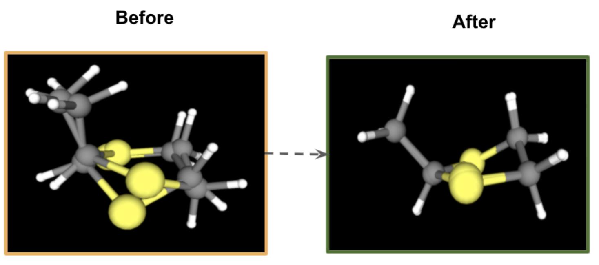

## Data Collection

References and associated compound lists are selected based on the interests of the scientific contributors.  This should include consideration of relevance to the scientific community. To authenticate and validate SMILES strings we employ interoperability tools to other cheminformatic software to verify it's usability.

The IUPAC/SMILES strings may be abstracted in a variety of methods:

- For IUPAC naming we opted for naming things as they were reported in the literature. If no names were available, then we opted to find a natural name to fill the slot.

- For IUPAC naming, we chose to reduce the complexity of the name by opting to remove as much stereochemistry as made sense. 

- For Polymer IUPAC, the site points were omitted from the name and some of the nomenclature adjusted for preferred names
over traditional. For example: 'yl' to mark site points for polymer connections was removed in favor of reduced english complexity. Site points are marked with a virtual atom that can be installed into the SMILES string with the character '*'.

-  For simple molecules one representation of the SMILES can be directly translated using visual 
inspection. This is typically appropriate for compounds at the beginning of a reported list that contain the most common denominator rings. 

- For complex molecules the image can be redrawn in the free version of ChemDraw and then translated into SMILES. 

- For sources where the SMILES are written and the IUPAC is not known the SMILES are translated into ChemDraw and the name retrieved. 
Note that some of the names may be modified based on human inspection in favor of preferred names. 

- In the case of radicals, some SMILES were adjusted to remove the radical chemical feature as they serve as connection points. However in some cases the radical component was maintained, especially in the case of IUPAC blue book common substituents or instellar space where radicals are more unknown and not as well explored.

- SMARTS strings were adapted from the SMILES using RDKit [@Landrum:2019-5]. 

- Stereochemistry which is represented as '@' and '@@' as R and S respectively are removed from the SMILES in order to reduce complexity.

## Cheminformatics Test

Global-Chem parsed through seven different tools with majority being successful minus diamond represented with an '&' [Reference Here] and fails with all software including RDKit except the GlobalChem Encoder does account for it. (it is not clear) The percentage of passing is as follows: RDKit 100% [Reference Here], DeepSMILES 99.25% [Reference Here], PartialSMILES 85.7% [Reference Here] , SELFIES 100% [Reference Here], MolVS 98.5% [Reference Here], PySMILES 99.8% [Reference Here]. PartialSMILES proved to be the most robust acceptance/rejection tool in identifying misrepresentations of SMILES. 

| Software        | Number of Failed Compounds | Example of Failed SMILES                                   |
|-----------------|----------------------------|------------------------------------------------------------|
| RDKit           | 0                          |                                                            |
| SELFIES         | 0                          |                                                            |
| Indigo          | 8                          | 'CC([Si](C1=CC=CC=C1)C2=CC=CC=C2)(C)C'                     |
| PySMILES        | 5                          | '[a].[Na+].[K+].[Mg+2].[Ca+2].[Cl-]'                       |
| DeepSMILES      | 8                          | 'OC(C1=CC=CC=C1N2)C2=O', 'C1(N2C(CN=C3)=NN=C2)=C3C=CC=C1'  |    
| MolVS           | 24                         | 'n1ccnc1', 'HF', 'O=N1CCCCC1'                              |
| PartialSMILES   | 337                        | '[CH]C', '[N]=[N+]=[N-]'                                   |

  <i>Table 2: Intereoperability Results of Common Moleculesfrom Global-Chem against different cheminformatic software</i>

Indigo's encoder was pretty robust and their software allows for a lot of inteoperabiltiy with different software tools (i.e pdf data parsing of SMILES), when faced with the tert-butyldiphenylsilyl protecting group and the SMILES string with the `Si` is not wrapped in a square brackets that specify an element that doesn't have a complete valence shell. For PySMILES, the inclusion of the '[a]' denoting aromaticity for an "aromatic salt" in the database couldn't be processed. Some other encoders have encoded for an aromaticity keyword as specified in the Daylight Technical Documentation [Reference Here].  DeepSMILES was interesting because it failed on specific functional groups as shown in the example with an oxindole and triazolodiazepines that had complex small branch complexities and moetieies that it didn't foresee existing. MolVS had some interesting results where imidazole (and derivatives) failed probably because it expected for a hydrogen perhaps to be explicity stated due to it's varying protonation states. Hydrofluoric acid was something I was expecting but again the hydrogen actually needed to be enforced with a [H] which is not as intuitive. PartialSMILES proved to be the most robust eluding to SMILES that were partially complete and rejected by their criteria. Failures included a ethyl radical and a azido complex stemming from the interstellarspace molecules. 

## Detection of Rare Compounds

To detect rare based compounds we utilize the sunbursting software method within the Global-Chem Extensions package to illunminate a portion of the Enamine Database that passed CGenFF to find new ring system compounds. 
The first layer is a lexical key to the functional groups abstracted from the the "RingsInDrugs" node reported in GlobalChem that could be a good reference to common rings with possible rare atom type scenarios. 
The next layer identifies chemical compounds that have at least two matches with the ring functional groups being considered meaning they exist within the same SMILES string. 
The next layer is the total atom charge penalty score for the SMILES string and the final layer consists of the individual, highest penalty atom and its atom type existing within that SMILES string. 
It is the highest penalized atom type in the functional group that is the information needed by the user to initiate the parameter optimization process. By using this combination of common ring systems with rare atom types we can possibly find new rings that are similar but slightly different according to the atom type.
Which could be useful to the community for small functional group conversion and preserveing functionality while possibly expanding it's application.

  
   
  <i>Figure 6: Application of the Sunbursting Method Applied on CGenFF Atom Types and RingsInDrugs GlobalChem Node</i>

We found an amide in conjunction with the disulphur embedded cyclopentyl ring called officially a dithiolane. 
Dithiolanes are easy to synthesize [Reference Here], naturally occurring [Reference Here], and becoming an emerging potent anchor fragments in drug design [Reference Here] and
 their parameters were deemed the most valuable to append to CGenFF out of the dataset.

# CGenFF ForceField Parametirization of the 1,2-Dithiolane

We truncated dithiolane from the amide and passed through CGenFF (Full data available in the Supporting Information) which indicated that the dilemma was in part due to the extent of puckering caused by the 2 Sulphur atoms within the constrained cyclopentane ring system. T
To begin our parametirization process we chose to focus on `S1-C3-C4-S2`, backbone to the cyclopentane ring and the dihedral from the methyl to one carbon on the backbone `C1-C2-S1-C3`. Since the molecule is symmetric, it makes the complexity of the molecule decrease twofold. 
The parametirization of 1,2-dithiolane was performed using FFParam [Reference Here] following the FFParam Workflow [Reference Here]. To begin our process, we first subject the compound to quantum mechanics (QM) geometry optimization, with Gaussian [Reference HEre], using mp2 theory to treat electron correlation [Reference Here] and basis set of “6-31/+G*” to handle the orbital polarizability of the sulphur atom. 
Our intended goal is to use the QM as a reference target data that the molecular mechanics (MM), CHARMM [Reference Here], should approximately match. We perform potential energy surface (PES) scans around our selected dihedrals and compare the surface of the QM vs the MM. 

To match the PES scan for the MM to the QM we have to tweak “tunable” parameters as defined in charmm potential energy function (i.e force constants, multiplicity) [Reference Here] 
until we reach a reasonable surface scan and numbers that make common sense. To determine the partial charges, we observe 
the dipole moment induced by the interaction between the atom of interest and water. When the dipole moment of the QM and MM reach within a range 
(< 0.5kcal/mol) we consider that reasonable. 

To accomplish our parametirization we applied the following: for `S1-C3-C4-S2`, if we break the connection ring component 
around the C3-C4 single bond in the  atom ring we obtain a natural rotation of a thiomethyl group. Additional multiplicities of 1 and 2 of varying force constants
seemed to have a negative effect. We added a relatively high force constant of a value of 2.3800 to because this particular 
dihedral is part of a ring where there is a significant energy barrier of rotation due to constraint of the cyclopentane backbone. 

For C1-C2-S1-C3, still maintained the multiplicity of 3 but with a far less reduced force constant of 1.1000. 
This was due to the methyl that replaced the amide allowing some degrees of rotation but the S1 is still constrained within the ring system. 
Final PES scans are displayed in Figure 8. 

  
   
  <i>Figure 7: Final Potential Energy Scans of dihedrals S1-C3-C4-S2 and C1-C2-S1-C3</i>

Lastly, the S1-S2 charges needed adjustment. We used Monte Carlo Simulated Annealing (MCSA) method [Reference Here] utilized in
FFparam to predict the approximate partial charges. The sulphur atoms were adjusted to have a partial negative charge of -0.208.
The initial and final modeled result of the dihedral energy scans dithiolane is displayed in Figure 7 with a visual validation allowing us to see inspect what the results of the work performed displayed in figure 8.

  
   
  <i>Figure 8: Visual Inspection of the 1,2-dithiolane</i>

