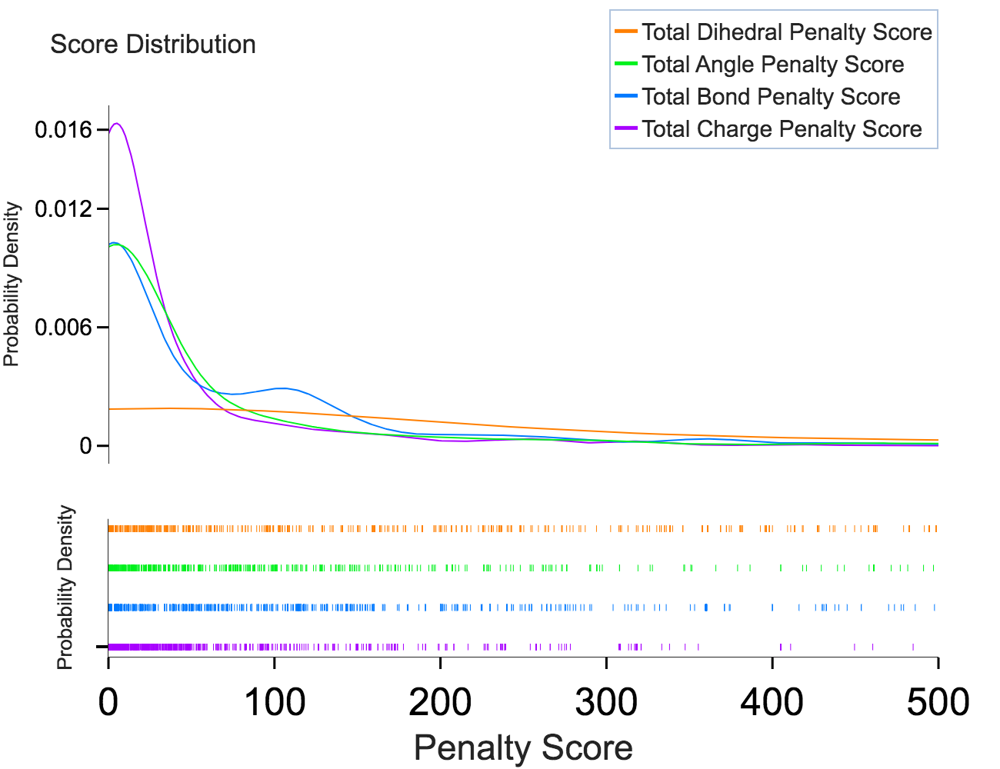
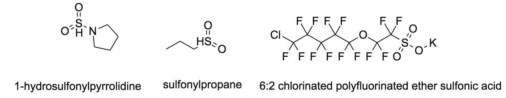
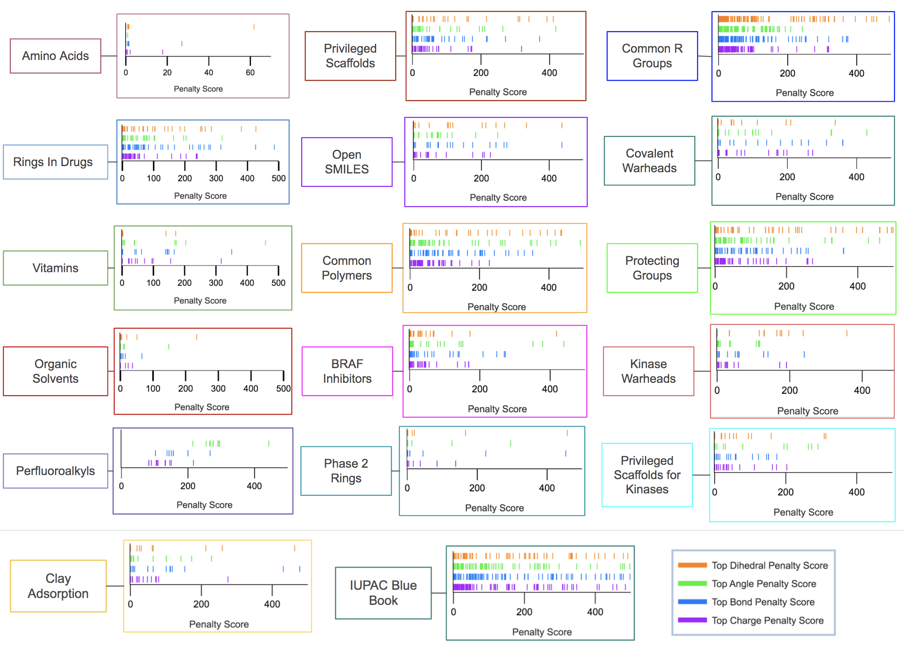

# Introduction

The in silico chemical universe is expanding rapidly as open access titan databases (Enamine Database (20 Billion) [@Gorgulla:2020-4],
Zinc Database (2 Billion) [Irwin:2020-12], PubMed Database (68 Million) [Roberts:2001-2]) and cheminformatic tools
to process, manipulate, and derive new compound structures are established. While this chemical data big bang has yielded useful ultra-large datasets they are based on ambiguous classification systems making it difficult to systematically organize them for specific uses.

  
   
  <i>Figure 1: Screenshot of the ZincDB request URLS</i>

In `Figure1`, you can observe the directory setup for downloading ZincDB molecules with their respective directory nomenclature which can be tricky to navigate.  Previously, partial organizational attempts were made on PubMed, filling chemical data linkages for computational toxicology called Actor for a specific
refactored and refined effort [Judson:2019-9]. For the EnamineDB, a scaffold associated with biological activity was designed to target 
Toll-Like Receptors in an object-oriented fashion [Perez-Regidor:2016-9]. These organizational methods are difficult
to extend to other systems as well as can be difficult to implement given the large amount of data.
In addition, the information content of these papers is of limited utility to the common developer. 

To organize data we apply the idea of communication. Humans use symbols and drawings to communicate, a set of symbols and the rules to combining them are called a language. 
Languages can be employed to carry relevant, distinct features and mean something to their respective community. 
International Union of Pure and Applied Chemistry (IUPAC) was a coalition that formed in the 1800s and their method of communication is named after the organization, IUPAC. 
IUPAC is a written language that predates even drawing atoms as a method of communication between chemists [Cooke-Fox:1989-5]; 
other chemical sub-communities also adopted the language and applied to their field to different dialects i.e polymer chemistry, organo-metallic chemistry.
In the recent years, SMILES [Weininger:1988-5] is becoming a popular 1-D language amongst cheminformaticians as a sufficient way to write and retain 2D or 3D geometry with ease.
Due to it's "first to market" scientific chemical language IUPAC is the legacy language that is a lexical key to unlocking informational wealth about a chemical pattern or group. 
But there are problems with the language due to it's length in describing bigger molecules. IUPAC names in organic chemisty papers can extend pages with no real value. 

To compact information, chemists just released the drawings but that can be hard to store precisely. Algorithms
are being designed to abstract and interpolate skeletal patterns and languages and convert them into SMILES for data processing and analysis. 
A lot of these tools are well summarized by the Blue Obelisk Society Open Source Review [OBoyle:2016-9]. And they work to some degree of accuracy. 
These tools are then improved on and machine learning starts dominating as a model that sits on top to fix any inaccuracies of the algorithm. 
If we took it another direction, where we selectively aggregate data based on popularity, usefulness over time, and organized to a degree of functionality but that much expertise amongst one person is not enough.
You need many opinions to come to a standard set. 

In the context of a well-classified chemical database the major challenge is the enormity of the chemical universe. Accordingly, it takes a range of chemical expertise to put together a well-thought chemical list of compounds relevant to their respective community.
Thus, it is necessary for a large number of participants to contribute in order for such a database to grow. 
However, most software and especially old software can be difficult to install and handle on top of modern technology thus driving the
need for something sustainable that is readily accessible to potential participants, allowing the database to naturally grow.
This need motivated the development of the presented `Global-Chem` database

To implement `Global-Chem` we needed to pick a coding language that has the ability to write easy objects for particpants to understand; Python.

  
  <i>Figure 2: Language Construction </i>

Python was also chosen because of it's distribution infrastructure that allows for easy installation of objects available on the cloud. This 
allows `Global-Chem` to function as a free service behaving in the same manner of communication and mass distribution as the Gideon Bible. 

# Methodology and Implementation

## Paper Selection Philosophy

Scientists, by nature of their work, are required to read extensively about 
selected scientific fields as well as access the associated data. This allows for scientists to develop expert knowledge in the fields and data they value most.
This requires a thin layer data organization that allows for the relevant information and data to be readily accessed.
To achieve this we begin by forming connections of the most relevant data according to chemicals sub-fields that have been authored
by experts in the different fields. `Figure 3` depicts the graph Module layout of `Global-Chem`.

  
  <i>Figure 3: Network Graph of Global-Chem</i>

## Object-Oriented Design

`Global-Chem` follows a simple object-oriented design where directories are the parent nodes and articles or books are leaf nodes.
In `Figure 2`, each leaf node is labeled appropriately as a class name to the reference-source paper or book. Each reference object
has either the functional groups that correspond to that paper's overall functionality in IUPAC, Preferred Name, Acronyms, SMILES, SMARTS
format. The motivation for this design was that as more users contribute they can expand into different directories, add their own directory, 
and provide their chemical list of interest. Each paper that is selected is converted into a `namespace` module, an object
whose name is indicative of it's functionality. An example for the drug design community is the paper "Rings In Drugs" [Taylor:2014-6] whose
python object equivalent is now "RingsInDrugs" with two functional methods that retrieve the  IUPAC:SMILES/SMARTS dictionary that was embedded included in the master object `Global-Chem`. 
Users can choose to cross reference leaf nodes between each other and do comparative chemical lists studies since the IUPAC name and SMILES name should be retain consistent.
Note that not all the time that the SMILES portrayed is canonical. Users can decide to parse `Global-Chem` SMILES into the `RDKit` parser
for canonical SMILES conversion if they wish. 

## Manual SMILES abstraction

References and associatied compound lists are selected based on the interests of the contributing authors.  This should include consideration of relevance to the scientific community. 
The SMILES strings are abstracted in a variety of methods:

-  For simple molecules one representation of the SMILES can be directly translated using visual 
inspection. This is typically appropriate for compounds at the beginning of a reported list that were the most common denominator rings. 

- For complex molecules the image can be redrawn in the free version of ChemDraw and then translated into SMILES. 

- For sources where the SMILES are written and the IUPAC is not known the SMILES are translated into ChemDraw and the name retrieved. 
Note that some of the names may be modified based on human inspection in favor as well for preferred names. 

- For polymer papers, the site points were omitted from the name and some of the nomenclature adjusted for preferred names
over traditional. For example: 'yl' to mark site points for polymer connections was removed in favour of reduced english complexity. 

- Some SMILES were adjusted from their radical complement as they served as connection points. Some decisions were made to keep the radical component especially in the case if the IUPAC blue book common substituents. 
over traditional names. 

- SMARTS strings were adapted from the SMILES using RDKit [@Landrum:2019-5]

# Data

At the time of writing the list of objects includes:

| Chemical List                       | Languages                    | # of Entries | References               |
|-------------------------------------|------------------------------|--------------|--------------------------|
| Amino Acids                         | IUPAC/SMILES/SMARTS          | 20           | Common Knowledge         |
| Essential Vitamins                  | Preferred Name/SMILES/SMARTS | 13           | Common Knowledge         |
| Common Organic Solvents             | IUPAC/SMILES/SMARTS          | 42           | [Fulmer:2010-5]          |
| Open Smiles                         | IUPAC/SMILES/SMARTS          | 94           | [OpenSmiles]             |
| IUPAC Blue Book (CRC Handbook) 2003 | Preferred Name/SMILES/SMARTS | 333          | [CRC:2004]               |
| Rings in Drugs                      | IUPAC/SMILES/SMARTS          | 92           | [Taylor:2014-6]          |
| Phase 2 Hetereocyclic Rings         | IUPAC/SMILES/SMARTS          | 19           | [Broughton:2004-9]       |
| Privileged Scaffolds                | IUPAC/SMILES/SMARTS          | 47           | [Welsch:2010-6]          |
| Common Warheads Covalent Inhibitors | IUPAC/SMILES/SMARTS          | 29           | [Gehringer:2019-6]       |
| Common Polymer Repeating Units      | IUPAC/SMILES/SMARTS          | 78           | [Hiorns:2019-6]          |
| Common R Group Replacements         | IUPAC/SMILES/SMARTS          | 499          | [Takeuchi:2021-9]        |
| Electrophillic Warheads for Kinases | Preferred Name/SMILES/SMARTS | 24           | [Petri:2020-12]          |
| Privileged Scaffolds for Kinases    | IUPAC/SMILES/SMARTS          | 29           | [Hu:2021-3]              |
| BRAF Inhibitors                     | IUPAC/SMILES/SMARTS          | 54           | [Agianian:2018-6]        |
| Common Amino Acid Protecting Groups | IUPAC/ACRONYM/SMILES/SMARTS  | 346          | [Isidro-Llobet:2009-6]   |
| Emerging Perfluoroalkyls            | IUPAC/SMILES/SMARTS          | 27           | [Pelch:2019-9]           |
| Chemicals For Clay Adsorption       | IUPAC/SMILES/SMARTS          | 33           | [Orr:2019-9]             |
| Schedule 1 United States Narcotics  | Preferred Name/SMILES/SMARTS | 240          | [21CFRPart1]             |
| Schedule 2 United States Narcotics  | Preferred Name/SMILES/SMARTS | 60           | [21CFRPart1]             |
| Schedule 3 United States Narcotics  | Preferred Name/SMILES/SMARTS | 22           | [21CFRPart1]             |
| Schedule 4 United States Narcotics  | Preferred Name/SMILES/SMARTS | 77           | [21CFRPart1]             |
| Schedule 5 United States Narcotics  | Preferred Name/SMILES/SMARTS | 8            | [21CFRPart1]             |
| Common Regex Patterns               | Mol2                         | 1            |                          |

  <i>Table 1: GlobalChem Object List</i>

# Tests & Applications

A total collection of 2153 IUPAC/Preferred Name/Acronym to SMILES/SMARTS was collected (with redundacy) across 17 objects in
an organized fashion by subject. The code was refactored extensively to allow for ease of object addition according to subject and functionality.

## Results 

To test the utility of these lists with other software tests were performed on three open source platforms to determine 
data interoperability. Although, it can be suggested that some of the software implemented should be expanded to perhaps
include functional groups that could not be parsed. 

## Cheminformatics Test

Two open-source cheminformatic platforms our now widely considered as foundational tools: RDKit and Indigo. To test each SMILES string, each string gets
passed into a `Mol` RDKit object and `Indigo.loadMolecule()` object where any failures are recorded. 
Results on the number of failed compounds out of the 2153 compounds along with example of failed molecules is presented in Table 2.
Cheminformatic interoperability between different platforms promotes wider utilization. For example, OpenBabel is another
utility that may used as a tolerance checker.

| Software | Number of Failed Compounds | Example of Failed SMILES                                |
|----------|----------------------------|---------------------------------------------------------|
| RDKit    | 11                         | 'CSi(C(C)(C)C)C', 'C&1&1&1&1',                          |
| Indigo   | 8                          | 'C&1&1&1&1', 'CC(Si(C1=CC=CC=C1)C2=CC=CC=C2)(C)C'       |

  <i>Table 2: GlobalChem Tolerable Results</i>

## ForceFields Test

Access to broad collections of chemical groups will be of interest for development of force fields for molecular modeling and molecular dynamic simulations, allowing for studies on a wider range of chemicals and biological systems. The ability of a force field to treat molecules in the database can also serve as dual interoperable test 
for SMILES strings. Popular force fields such as General Amber ForceField (GAFF) [Wang:2004-7], Optimized Potentials for Liquid Simulations (OPLS)
[Jorgensen:1988-7], and Charmm General Force Field (CGenFF) [Vanommeslaeghe:2010-3] are based on collections of chemicals that are representative of the particular region of chemical space that the force field was designed to cover. 
In practice, this involves the atom-typing engine of each force field being applied to each molecule followed by assignment of the appropriate parameters.
This is to a large extent associated with the coverage of a force field.  Thus, the compound lists in Global-Chem can be used to identify specific regions of chemical space that have limited coverage and, therefore, represents future regions of chemical space for force field development. 
In the present study, we used CGenFF to check it's tolerance level for the range of molecules currently in Global-Chem. To facilitate this an in-house extension of CGenFF was used that can assign atom types from `SDF` bond type column. This enabled us to pass the SMILES strings
through `RDKit` and transform `SDF` to a `CGenFF` stream output. The resulting failures are also presented in Table 2. It should be noted by nature of the data processing workflow the anything that fails in `RDKit` fails in `CGenFF`.

`CGenFF` was founded on drug-like molecules and to test it's capability of handling what's reported in literature it's performance
is tested in accordance with it's penalty score distribution [Vanommeslaeghe:2012]. The penalty score is attributed to when an arbitrary molecule is 
passed through when it hasn't seen it before, it navigates an atom type similarity network tree through a set of rules.
Each tree traversal is associated with a penalty score as it browses for similar substitution for alternate parameter assignment. 
Once the lowest penalty score atom-type substitution is determined, `CGenFF` assigns the parameters and tell's you in the output stream file which
functional group the parameters are from. Charge penalties are chosen on a bond-charge increment scheme where atom type geometric classifications: 
bond, angle, dihedral are associated with a charge increment value subtracted from it's formal charge. 
This value is associated with how these two atoms behave, electronically, in the environment space it is in. It is noted 
that the dihedral charge increment is set to a limit to of 50.

The lower the distribution is to 0 the more performant the forcefield is. The distributions are reported in accordance with bonds, angles, dihedrals, charge classifications of the charmm potential energy equation. 

  
  <i>Figure 4: Charmm Potential Energy Equation Picture Depiction: Top row and bond row is bonded and non-bonded terms respectively. </i>

We passed each object individually into `CGenFF` recorded the results. <b>Note</b> that due to our initial input being SMILES we had to offer up some of the original functionality of `CGenFF` that was used to process `mol2` for bond assignment. Whereas now we rely on `SDF` and go through our own in-house decision tree. For anything `CGenFF` determines it cannot find an adequate substitute within reason
returns a failed response. These failed responses are captured. It is noted, that the IUPAC blue book is a list of radicals (Object 14 in the tests) which is the reason for it's repeated compound failures which you can see in the log file. Other noteworthy failures that would be of particular interest are listed in `Figure 5`. For example, cyclobutadiene is a non-traditional ring system with a lot of ring strain where the carbon atom types are common. `CGenFF` might determine that this particular ring system with it's existing atom type network is not allowed or detrimental to the network if added and needs to be handled with care. Silicon-based systems seems to be more ubuiqituious in these data sets and a lot of the failures are attributed to silicon-based compounds. An interesting functional group to handle would be the allene-based compounds and perhaps warrant a new carbon atom type. 

  
   
  <i>Figure 5: Failed CGenFF Compounds</i>

### Discussion 

An interesting observation from the present data is the ability of tools to handle the ampersand `&` operator in SMILES for materials. For example, diamond is a common carbon substance whose SMILES strings is indicated in the OpenSMILES
documentation as a `C&1&1&1&1`. As shown in Table 2, this fails in both `RDKit` and `Indigo` indicating that improve handling of the `&` operator is required.

  
  <i>Figure 6: Penalty Score distributions</i>

The penalty score distributions are shown in `Figure 6` in a rug fashion to show how much chemical feature space can `CGenFF`
extend to. If we look at one trend of the data of four leaf nodes: BRAF Kinases Inhibitors for Cancer (54) to Privileged Scaffolds (47) to Common Warheads (29) to  Emerging PerfluoroAlkyls (27). The theory is that any kinase inhibitors should exhibit drug-like features similar to what was chosen to CGenFF, privileged scaffolds are any elected scaffolding produced by nature, warheads designed for covalent inhibition, and a stretch into herbicides and toxicity
that are toxic to us. We expected `CGenFF` to perform on anthing drug-like and not so much for chemical manufacturing. 

In `Figure 6`, we can see that `CGenFF` is performing well on parameter assignment for BRAF Kinase Inhibitors owed to its initial training set of "drug-like" molecules. For mother nature's elected scaffolds for small molecules which also mimics the definition of "drug-like".
For covalent inhibitor warheads, non-traditional "drug-like" molecules given their purpose
is to bind into the receptor which is only a newly established recent ascent [Gehringer:2019-6]. The penalty score is more dispersed
because these are recent advancements in science that could be useful to the drug-like community. It still behaves well with 
some outlier compounds that we can focus on parametirizing. And lastly, perfluoroalkyls are used in chemical manufacturing 
of everyday goods [Pelch:2019-9]. This is not what `CGenFF` was intended for but still assigns parameters that do not extend
too far from the existing atom-types built into the forcefield. We can arguably say, that if we add one perfluoroalkyl to
`CGenFF` it will help reduce penalties for the rest of the dataset as well be useful to the chemical hazard community.

# Statement of Purpose

Chemical lists are private information that is buried within corporations protected under intellectual property/non-disclosure agreements or academic papers imprisoned by the paywall publication system of their own making. Neither academia nor industry is allowing real sciencee to develop. Instead of sharing information we rely on complicated hard-coded algorithms making arbitrary decisions without actual scientific backing. `Global-Chem` has a lot potential purposes (teaching, inferences, cheminformatics) but our main perogative is to create a free record collection. If we plant the seed now then, hopefully, our tree will grow. As it grows, the answers we seek will become more clear and reasoned with some level of scientific thought. Together, we can build the biggest network regardless of where you are from and who you are.  

# Acknowledgements

Thank you to Jacob Weiner, Tyree Wilson, Paul Shapiro for their helpful discussions into the usability and functionality of Global-Chem.
Appreciation to the University of Maryland School of Pharmacy Department of Pharmaceutical Chemistry for promoting a collaborative and useful space for 
academics. Financial support from the NIH (GM131710) is acknowledged.

# Conflict of Interets

ADM is cofounder and CSO and SJ is Commercial Development Director of SilcsBio LLC.
