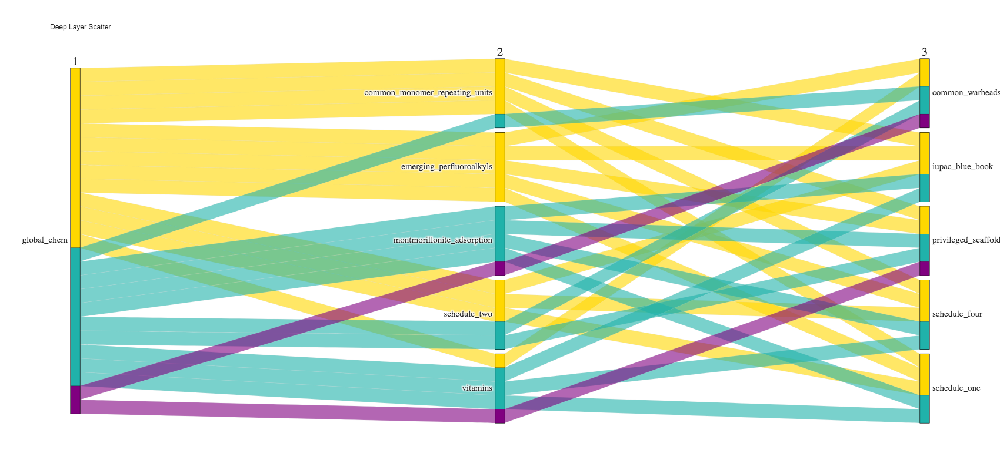

# Introduction

The in silico chemical universe is expanding rapidly as open access titan databases (Enamine Database (20 Billion) [@Gorgulla:2020-4],
Zinc Database (2 Billion) [@Irwin:2020-12], PubMed Database (68 Million) [@Roberts:2001-2]) and cheminformatic tools
to process, manipulate, and derive new compound structures are established. While this chemical data big bang has yielded useful ultra-large datasets they are based on ambiguous classification systems making it difficult to systematically organize them for specific uses.

{ width=50% }

For example, in `Figure 1`, the directory setup for downloading ZincDB molecules is shown. As is evident, the information content of the directory nomenclature does not contain information on the compounds they contain, making it nearly impossible to access specific molecules or classes molecules.  
Towards overcoming this, partial organizational attempts were made in PubMed, filling chemical data linkages for computational toxicology called Actor for a specific
refactored and refined effort [@Judson:2019-9]. In another example, for the EnamineDB a scaffold associated with biological activity was designed to target 
Toll-Like Receptors in an object-oriented fashion [@Perez-Regidor:2016-9]. However, these organizational methods are difficult
to extend to other systems and can be difficult to implement given the large amount of data.
In addition, the information content of these papers is of limited utility to the common developer. 

To organize chemical compounds we apply the idea of communication. Humans use symbols and drawings to communicate, a set of symbols and the rules to combining them are called a language. Languages can be employed to carry relevant, distinct features and mean something to their respective community. diagrammatically shown in `Figure 2`. 
International Union of Pure and Applied Chemistry (IUPAC) was a coalition that formed in the 1800s and their method of communication was named after the organization, IUPAC. 
IUPAC is a written language that predates even drawing atoms as a method of communication between chemists [@Cooke-Fox:1989-5]. 
Other chemical sub-communities adopted the IUPAC language and applied it to their fields that are comprised of different dialects i.e polymer chemistry, organo-metallic chemistry.
Due to it's "first to market" status, the scientific chemical language IUPAC is the legacy language that is the lexical key to unlocking information about a chemical pattern or group. 
But there are problems with the language due to it's length in describing bigger molecules. Simply, IUPAC names in organic chemisty papers are impractical, effecting extending the length of a manuscript,  while being of limited value given the challenge of interpreting such names.

To implement `GlobalChem` we selected a coding language that has the ability to write easy objects for particpants to understand; Python [10.5555/159351][@Cooke:1989-5].

{ width=100% }

## Statement of Need

To compact information, chemists presented drawings of chemical structures but information in such a format is hard to store precisely. Alternatively, SMILES [@Weininger:1988-5] has become a popular 1-D language amongst cheminformaticians as a sufficient way to write and retain 2D chemical connectivity information with ease.  Algorithms
have been designed to abstract and interpolate skeletal patterns and languages from chemical drawings and convert them into SMILES for data processing and analysis. 
A number of these tools, which work to varying degrees of accuracy, have been well summarized by the Blue Obelisk Society Open Source Review [@OBoyle:2016-9]. 
Efforts to improve these tools recently have included machine learning (ML) methods that essential "sit" on top of the underlying algorithm to fix any inaccuracies of the method. 
As an alternative we can take another direction, where data is selectively aggregated based on known classifications, popularity and utility, being organized to a degree of functionality that facilitates more widespread use. However, the criteria for such an aggregation of data is built upon human expertise, requiring input from a variety of people to attain the broadness and accessibility that would facilitate scientific discovery. 
In other words, in the context of a well-classified chemical database the major challenge is the enormity of the chemical universe, requiring a range of chemical expertise to put togethe well-thought chemical lists of compounds relevant to their respective communities. 
Thus, it is necessary to create a tool to allow for a large number of participants to contribute in order for such a data compilation to grow. 
However, most software and especially old software can be difficult to install and handle on top of modern technology thus hindering participation. This situation drives the
need for a tool that is sustainable and readily accessible to potential participants, allowing the graph network to naturally grow.
This need motivated the development of the presented `GlobalChem` network tool.

# Software Methodology

## Chemical Set Selection & Object-Oriented Design Philosophy

Scientists, by nature of their work, are required to read extensively about 
selected scientific fields as well as access the associated data. This allows for scientists to develop expert knowledge in the fields and data they value most.
To take advantage of this knowledges requires a thin layer data organization that allows for the relevant information and data to be readily accessed.
To achieve this we begin by forming connections of the most relevant data according to chemicals sub-fields that have been authored
by experts in the different fields. `Figure 3` depicts the node Module layout of `GlobalChem`. Each blue circle represents a relevant field and their subsequent tree networks are highlighted by a contrasting colour.

{ width=100% }

## Data

At the time of writing the list of nodes include those shown in Table 1. The list range from well defined classes of chemicals, such as amino acids, to more diverse lists such as Rings in Drugs. In addition, the languages used for each list are given, along with the number entires in the list and the reference. 

| Node List                            | # of Entries | References                |
|--------------------------------------|--------------|---------------------------|
| Amino Acids                          | 20           | Common Knowledge          |
| Essential Vitamins                   | 13           | Common Knowledge          |
| Common Organic Solvents              | 42           | [@Fulmer:2010-5]          |
| Open Smiles                          | 94           | [@OpenSmiles]             |
| IUPAC Blue Book (CRC Handbook) 2003  | 333          | [@CRC:2004]               |
| Rings in Drugs                       | 92           | [@Taylor:2014-6]          |
| Phase 2 Hetereocyclic Rings          | 19           | [@Broughton:2004-9]       |
| Privileged Scaffolds                 | 47           | [@Welsch:2010-6]          |
| Common Warheads Covalent Inhibitors  | 29           | [@Gehringer:2019-6]       |
| Common Polymer Repeating Units       | 78           | [@Hiorns:2019-6]          |
| Common R Group Replacements          | 499          | [@Takeuchi:2021-9]        |
| Electrophillic Warheads for Kinases  | 24           | [@Petri:2020-12]          |
| Privileged Scaffolds for Kinases     | 29           | [@Hu:2021-3]              |
| BRAF Inhibitors                      | 54           | [@Agianian:2018-6]        |
| Common Amino Acid Protecting Groups  | 346          | [@Isidro-Llobet:2009-6]   |
| Emerging Perfluoroalkyls             | 27           | [@Pelch:2019-9]           |
| Chemicals For Clay Adsorption        | 33           | [@Orr:2019-9]             |
| Schedule 1 United States Narcotics   | 240          | [@21CFRPart1]             |
| Schedule 2 United States Narcotics   | 60           | [@21CFRPart1]             |
| Schedule 3 United States Narcotics   | 22           | [@21CFRPart1]             |
| Schedule 4 United States Narcotics   | 77           | [@21CFRPart1]             |
| Schedule 5 United States Narcotics   | 8            | [@21CFRPart1]             |
| Common Regex Patterns                | 1            |                           |

  <i>Table 1: GlobalChem Master Node Network</i>

## GlobalChemExtensions

To exhibit the wide functionality and uses cases of `GlobalChem` we created an extension cheminformatics tool independent of the Graph Network 
because it depends on other open source dependencies. The reasoning behind this was that sometimes users would just want
the data and to ease the installation process we concomitantly two different components that work together. Full exhibition of the
`GlobalChemExtensions` can be found in the `Gitbook` documentation available here (https://sulstice.gitbook.io/globalchem-your-chemical-graph-network/). 
To highlight one functionality is the deep graph network extended into the plotly parallel coordinates plot shown in `Figure 4`. This gives
visibility into deep lexical layered graphs and help aid in organizing sets of chemical data.

  
   
  <i>Figure 4: Plotly Conversion using `GlobalChemExtensions` </i>

{ width=100% }

# Conclusion

`Global-Chem` was developed to facilitate the ability of scientists in both academia and industry to make their compounds of interest readily available to the scientific community in the form of objects that may be directly accessed from python. 
Accordingly, `Global-Chem` has a number of potential purposes, including teaching and cheminformatics, but our main perogative is to create a free record collection.
As `Global-Chem` requires direct user input, if we plant the seed now then, hopefully, our tree will grow. 
The actual growth of the tree will be decided on by the common chemical community and experts in the field. Enjoy. 

# Acknowledgements

Thank you to Daniel Khavrutskii, Jacob Weiner, Tyree Wilson, and Paul Shapiro for their helpful discussions into the usability and functionality of Global-Chem.
Appreciation to past mentors James Ryan, Robert Zeigler, and Blake Printy for discussions on good manufacturing practices of python packaging and distribution.
Appreciation to the University of Maryland Baltimore, School of Pharmacy, Department of Pharmaceutical Chemistry for promoting a collaborative and useful space for 
academics. Financial support from the NIH (GM131710) is acknowledged.

# Conflict of Interets

ADM is cofounder and CSO and SJ is Commercial Development Director of SilcsBio LLC. Chris Burke is Senior DevOps Engineer at L7 Informatics. 
