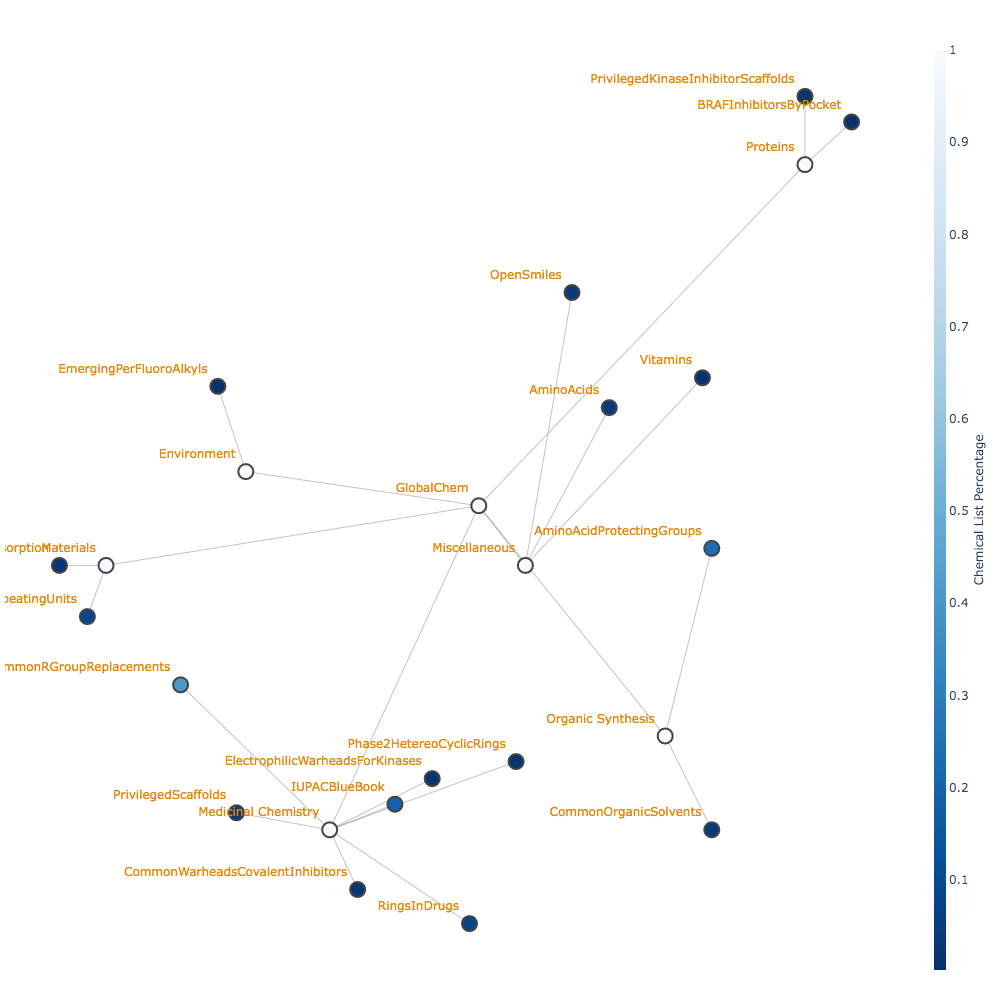

# Introduction

The chemical universe is expanding rapidly as open access titan databases (Enamine Database (20 Billion) [@Gorgulla:2020-4],
Zinc Database (2 Billion) [Irwin:2020-12], PubMed Database (68 Million) [Roberts:2001-2]) and cheminformatic tools to process, manipulate, and derive new
compound structures are established. This left us with a chemical data big bang with ultra-large datasets and no proper classification system to organize
the data. This resulted in us having to rely on classical statistical mechanisms with manipulation of the numbers to infer meaning and neglects real scientific understanding with chemical languages. 

To classify we need to revert back to the idea of communication. Humans use symbols and drawings to communicate, a collection of symbols and their combinations
are called a language. Different languages can be employed to carry different features and mean different things to a variety of communities. 
For organic chemistry, we draw skeletal patterns to communicate, and a written language using english characters to communicate, this was established as IUPAC [Cooke-Fox:1989-5]; 
other chemical sub-communities also adopted the language and applied to their field to different dialects i.e polymer chemistry, organo-metallic chemistry.
In the recent years, SMILES [Weininger:1988-5] is becoming a popular 1-D language amongst cheminformaticians for large datasets compared to 2D or 3D data (more lines). 
With most ultra-large datasets stored primarily in SMILES, we can begin by organizing the data into appropiate classifiers that will make it useful for all communities.

To accomplish this, we elect our most useful papers that classify a functionality of a set of compounds. If we 
write the IUPAC name and the SMILES name we can create a 1:1 mapping as a piece in the puzzle of the drug pipeline. The SMILES can be used
to connect to other analysis tools and computational resources whereas the IUPAC name will talk to informational and literature resources chemists. 
We then move it into a easy distributable format where it's accessible to everyone to expand and use as a layer for organizing
and classifying their data. 

# Paper Selection Philosophy

Within academia, professors, post-doctorates, and graduate students, by nature of our work are required to read extensively about 
selective specific scientific fields. This in turn gives us an expert opinion in what data we value most. To start a thin layer data organization 
we begin by forming connections of most relevant data according to chemicals subfields. This is in accordance to the authorship
where each expertise opinion is recognized for different fields. 

<p align="center">
  
</p>

# Methodology and Implementation

### Software

``` GlobalChem``` operates as a standalone python3 object and packaged distributed on PyPi. It has a no dependencies 
as it's just a key, value store of strings. Different papers are organized as retrieval functions on the object which fetch
classifier nomenclature (similar to the paper it was abstracted from) in IUPAC/SMILES and IUPAC/SMARTS. The SMARTS string
is a superset of SMILES and is used as a string matcher when looking for functional groups. It can be derived using a 
popular chem(o)informatic tool, RDKit [@Landrum:2019-5].

### Data abstraction

Papers are selected based on interested and relevance in the scientific community dictated by us, the authors, in respect to our field. 
The SMILES is abstracted in a variety of methods:

-  For simplistic molecules one representation of the SMILES can be directly translated using visual 
inspection. This worked for compounds usually at the beginning of a reported list that were the most common denominator rings. 

- For complex molecules, the image can be redrawn into the free version of ChemDraw and then translated into SMILES. 

- For papers where the SMILES are written and the IUPAC is not known. We translate the SMILES into ChemDraw and then retrieve the name. 
Note that some of the names were modified based on human inspection in favor as well for preferred names. 

- For polymer papers, the site points were omitted from the name and some of the nomenclature adjusted for preferred names
over traditional. 

# Results

At the time of writing the list now the list stands at:

| Chemical List                       | Languages                    | # of Entries | References               |
|-------------------------------------|------------------------------|--------------|--------------------------|
| Amino Acids                         | IUPAC/SMILES/SMARTS          | 20           | Common Knowledge         |
| Essential Vitamins                  | Preferred Name/SMILES/SMARTS | 13           | Common Knowledge         |
| Common Organic Solvents             | IUPAC/SMILES/SMARTS          | 42           | [Fulmer:2010-5]          |
| Open Smiles                         | IUPAC/SMILES/SMARTS          | 94           | [OpenSmiles]             |
| IUPAC Blue Book (CRC Handbook) 2003 | Preferred Name/SMILES/SMARTS | 333          | [CRC:2004]               |
| Rings in Drugs                      | IUPAC/SMILES/SMARTS          | 92           | [Taylor:2014-6]          |
| Phase 2 Hetereocyclic Rings         | IUPAC/SMILES/SMARTS          | 19           | [Broughton:2004-9]       |
| Privileged Scaffolds                | IUPAC/SMILES/SMARTS          | 47           | [Welsch:2010-6]          |
| Common Warheads                     | IUPAC/SMILES/SMARTS          | 29           | [Gehringer:2019-6]       |
| Common Polymer Repeating Units      | IUPAC/SMILES/SMARTS          | 78           | [Hiorns:2019-6]          |
| Common R Group Replacements         | IUPAC/SMILES/SMARTS          | 499          | [Takeuchi:2021-9]        |
| Electrophillic Warheads for Kinases | Preferred Name/SMILES/SMARTS | 24           | [Petri:2020-12]          |
| Privileged Scaffolds for Kinases    | IUPAC/SMILES/SMARTS          | 29           | [Hu:2021-3]              |
| BRaf Inhibitors                     | IUPAC/SMILES/SMARTS          | 54           | [Agianian:2018-6]        |
| Common Amino Acid Protecting Groups | IUPAC/ACRONYM/SMILES/SMARTS  | 346          | [Isidro-Llobet:2009-6]   |
| Emerging Perfluoroalkyls            | IUPAC/SMILES/SMARTS          | 27           | [Pelch:2019-9]           |
| Chemicals For Clay Adsorption       | IUPAC/SMILES/SMARTS          | 33           | [Orr:2019-9]             |
| Common Regex Patterns               | Mol2                         | 1            |                          |

# Conclusion

A total collection of 2534 key value pairs are recorded across 25 variables that can be accessed through the `GlobalChem` class. 
